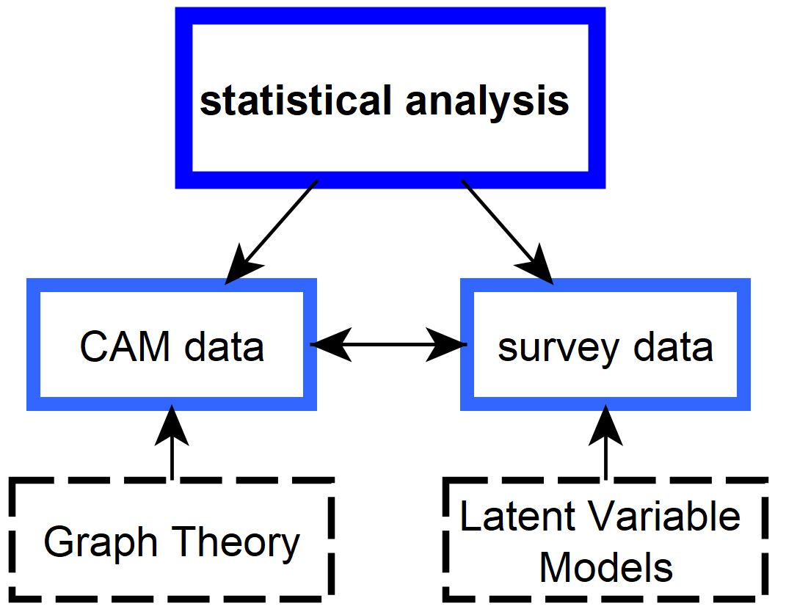
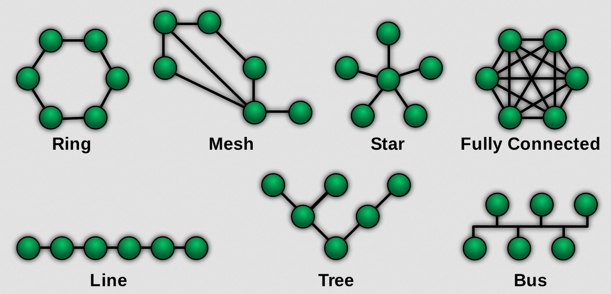

```{css, echo=FALSE}
.scrollChunk {
  max-height: 450px;
  overflow-y: auto;
  background-color: inherit;
}

.cite {
position: absolute; 
bottom: 0; 
right: 0;
}
```

```{r setup, include=FALSE, message = FALSE, warning=FALSE}
options(htmltools.dir.version = FALSE)
# library(fontawesome)

################
# Packages
################
# if packages are not already installed, the function will install and activate them
usePackage <- function(p) {
  if (!is.element(p, installed.packages()[,1]))
    install.packages(p, dep = TRUE)
  require(p, character.only = TRUE)
}

usePackage("stargazer") # create tables

usePackage("tidyverse")

usePackage("DT")

usePackage("RefManageR")

usePackage("meta")

usePackage("lsa")

usePackage("mvtnorm")


################
# Data Bib file
################
BibOptions(check.entries = FALSE, bib.style = "authoryear", style = "markdown",
           dashed = TRUE, longnamesfirst=FALSE, max.names=1)
# file.name <- system.file("Bib", "biblatexExamples.bib", package = "RefManageR")
file.name <- "LibrarySubset.bib"
bib <- ReadBib(file.name)

################
# Data
################
# load data

setwd("data/metaAnalysis")
files_xlsx <- list.files(path = getwd(), pattern = "*.xlsx", full.names = FALSE)


list_NetworkParams <- list(); h=1
for(f in files_xlsx){
  tmp_name <- str_remove_all(string = f, pattern = "CAMindicator_|\\.xlsx")
  tmp_dat <-  xlsx::read.xlsx2(file = f, sheetIndex = 1)


  list_NetworkParams[[tmp_name]] <- tmp_dat

  tmp_dat$group <- tmp_name
  if(h==1){
    allstudies <- tmp_dat
  }else{
    allstudies <- rbind(allstudies, tmp_dat)
  }

  h=h+1
}

allstudies <- as.data.frame(allstudies)
allstudies$X. <- NULL
allstudies$CAM_ID <- NULL
allstudies$participantCAM <- NULL


allstudies[, 1:26] <- as.data.frame(sapply(allstudies[, 1:26], as.numeric))
```


<!-- *********** NEW SLIDE ************** -->

## Table of Contents

Three parts:

1 Motivation
  + our team, CAMs
  + overall goal, already done
  + stochastic process of DGP of CAMs
  
2 Meta-Analysis
  
3 Two approaches to compute similarity of CAMs
  + latent structure identification algorithm
  + multilayer network


<br>

> aim of talk: (1) clustering of CAMs is possible, (2) these could inform reliability measures

<br>
 
.pull-left[
if you want to download the slides / R Code: https://github.com/FennStatistics/CAMtools_workshops
]

.pull-right[

<center>

</center>

]


<!-- *********** HEADING ************** -->
---
class: heading,middle


Part 0: When ChatGPT is doing your job!


<!-- *********** NEW SLIDE ************** -->
---
## Write a sensational press release of Cognitive-Affective Maps


FOR IMMEDIATE RELEASE

Revolutionary Cognitive-Affective Maps Empower People to Transform the Way they Think and Feel

A revolutionary new technology is transforming the way people think and feel. Cognitive-Affective Maps (CAMs) are a groundbreaking new tool that can help people better understand and manage their emotions and thoughts.

CAMs are based on the principles of cognitive science and use powerful visualizations to show how individual thoughts and emotions can interact and influence each other. By providing an intuitive way for people to understand their own mental processes, CAMs can help individuals to better recognize and manage their own emotions, helping to reduce stress, improve well-being, and increase productivity.

CAMs can be used to explore the root causes of negative thinking, identify potential solutions to problems, and develop plans for long-term well-being. The technology is also being used to support mental health professionals in their work with individuals who are struggling with mental health issues.

CAMs are being used by individuals, organizations, and businesses around the world to improve their quality of life. With its intuitive and powerful interface, CAMs are revolutionizing the way people think and feel. For more information about Cognitive ...

<br>
credits to the Large Language Model ChatGPT, try it out: https://chat.openai.com/auth/login


<!-- *********** NEW SLIDE ************** -->
---
## What are the potentials of Cognitive Affective Maps?


Cognitive Affective Maps (CAMs) have several potential benefits in the field of cognitive psychology and neuroscience:
1. Understanding the relationship between cognition and emotion: CAMs provide a framework for studying the complex interplay between cognitive processes (such as perception, attention, memory, and decision-making) and emotions.
2. Explaining emotional regulation: CAMs can help to explain how emotions are regulated and controlled through cognitive processes, such as attention and working memory.
3. Improving decision-making: CAMs can be used to study how emotions influence decision-making and can provide insights into how decision-making can be improved through emotional regulation.
4. Understanding the role of emotions in motivation: CAMs can help to explain the role of emotions in motivation and how emotions can drive behavior and action.
5. Improving our understanding of mental disorders: CAMs can be used to study the relationship between cognition, emotion, and mental disorders, such as depression and anxiety, and provide insights into how these disorders can be treated.

It's important to note that CAMs are just one of several approaches to understanding the relationship between cognition and emotion, and their potential benefits should be evaluated in light of the limitations and criticisms of the framework. Additionally, **further empirical research is needed to fully understand and validate the predictions made by CAMs***.

<br>
*sadly that's our job :(

<!-- *********** HEADING ************** -->
---
class: heading,middle


Part 1: Motivation


<!-- *********** HEADING ************** -->
---
class: heading,middle


Part 1: Motivation - our team, CAMs


<!-- *********** NEW SLIDE ************** -->
---
## our CAM team (a subset)

<center>

</center>

> especially without [Lisa's disseration](https://www.psychologie.uni-freiburg.de/Members/lreuter/Reuterdiss) we would be at a completely different stage of research / CAM tools development


> without Florian I would not have been able to program the CAM tools


<!-- *********** NEW SLIDE ************** -->
---
## CAMs I

CAMs as a quantitative and qualitative research method first became popular through [Paul Thagard](https://paulthagard.com/); possible to identify and visually represent any kind of declarative knowledge:


<center>

</center>


`r Citet(bib, c("sendtner_kostbare_2021", "thagard_empathica_2010"))`


<!-- *********** NEW SLIDE ************** -->
---
## CAMs II - theory

**What are CAMs?**

* CAMs are „conceptual structures that people use to represent important aspects of the world“
* „cognitive-affective map is a visual representation of the emotion values of a group of interconnected concepts“
  + this is how CAMs differ from semantic networks, because CAMs additionally contain emotions (valence)
  + hot cognition: emotions cannot be separated from cognitions
  
<br>
<br> 

**How are CAMs constructed?**

* the stepwise construction process of CAMs can be understood as a **multiple constraint satisfaction process**, where concepts, conditions, goals, etc. are mentally represented with the involvement of emotions
  + Concepts in the CAM are only changed or added if they correspond to the „most coherent account of what we want to understand“

<br>

`r Citet(bib, c("thagard_coherence_2000", "thagard_hot_2006", "thagard_cognitive_2021"))`


<!-- *********** NEW SLIDE ************** -->
---
## CAMs III - fields of application

* to study if CAMs are supplementary to questionnaires -  `r Citet(bib, c("mansell_novel_2021", "mansell_measuring_2021"))`
* agent-based modelling - e.g. `r Citet(bib, c("wolf_changing_2015", "schroder_modeling_2017"))`
* use CAMs for conflict mediation - e.g. `r Citet(bib, c("gros_camediaid_2021"))`
* evaluate via CAMs the success of an intervention - e.g. `r Citet(bib, c("reuter_leisure_2021", "luthardt_and_2020"))`
* ...

<br>
<br>
-> super interesting article with a pure methodological focus on CAMs, especially on network similarity: `r Citet(bib, c("luthardt_quantifying_2022"))`; methodological perspective developed by [Jonathan Morgan](https://scholar.google.co.uk/citations?user=HKo8keYAAAAJ&hl=en&oi=sra) who proposed measures to compute
* network similarity for CAMs
* concept association similarity
* affective similarity
* (generating random networks based on existing CAM data)


<!-- *********** NEW SLIDE ************** -->
---
## CAMs IV - fundamental hypothesis 

**Hypothesis**: The generation process of CAMs is not arbitrary, but is determined by multiple processes at multiple levels, and thus CAMs from similar individuals on an identical topic exhibit systematic correlations (similar data generating process)

* can be presented by a „emergent product of interaction between networks of mental representations at the individual level and networks of social communication at the group level“


<center>

</center>


> if stochasticity is ubiquitous in **complex networks**, these networks are not maximally random either; rather, they obey organization principles that make them functional


`r Citet(bib, c("bianconi_multilayer_2018", "homer-dixon_complex_2013"))`


<!-- *********** HEADING ************** -->
---
class: heading,middle


Part 1: Motivation - overall goal, already done


<!-- *********** NEW SLIDE ************** -->
---
## personal motivation for environmental psychology


.pull-left[
speech of António Guterres at the 2022 United Nations Climate Change Conference (COP 27):

> We are in the fight of our lives. 
And we are losing. 
Greenhouse gas emissions keep growing.   
Global temperatures keep rising.  
And our planet is fast approaching tipping points that will make climate chaos irreversible.
We are on a highway to climate hell with our foot still on the accelerator.  

<br>
see talk: https://www.youtube.com/watch?v=J3UdNagA31w
]

.pull-right[

Is he right?

monthly mean carbon dioxide measured at Mauna Loa Observatory, Hawaii: 


<center>

</center>

data collection started 1958: https://gml.noaa.gov/ccgg/trends/mlo.html

]


<!-- *********** NEW SLIDE ************** -->
---
## ... we are able to reduce CO2 emissions

pervasive disruptions from the COVID-19 pandemic have radically altered the trajectory of global CO2 emissions (by 7% compared to 2019):


<center>

</center>


>  **economic stimuli** on national levels could soon change the course of global emissions


`r Citet(bib, "le_quere_fossil_2021")`; [Maja Göpel](https://www.maja-goepel.de/), [Naomi Klein](https://naomiklein.org/)


<!-- *********** NEW SLIDE ************** -->
---
## motivating overall goal I

*  **ethical assessment of emerging technologies in real-time**, e.g. climate engineering technologies


.pull-left[

> A daunting task lies ahead for scientists and engineers to guide society towards environmentally sustainable management during the era of the Anthropocene. This will require appropriate human behaviour at all scales, and may well **involve internationally accepted, large-scale geo-engineering projects**, for instance to ‘optimize’ climate.

by `r Citet(bib, c("crutzen_geology_2002"))`
]

.pull-right[
<center>

</center>
]

<br>
-> huge investments by private and public sector, e.g. [Office of Fossil Energy and Carbon Management investing $2.52 billion to fund two carbon capture programs ](https://content.govdelivery.com/accounts/USDOEOFE/bulletins/3454f32)


<!-- *********** NEW SLIDE ************** -->
---
## motivating overall goal II

for the ethical assessment of emerging technologies in real-time is needed: 


.pull-left[
**a complex study design**

<center>

</center>

]

.pull-right[
**relating heterogeneous data sources**

<center>

</center>

]


<br>
`r Citet(bib, c("fenn_empirical_2022", "fenn_identifying_2022"))`


<!-- *********** NEW SLIDE ************** -->
---
## we need procedures of cluster analysis

**clustering**: task of grouping a set of objects in such a way that objects in the same group (called a cluster) are more similar (in some sense) to each other than to those in other groups (clusters)


<center>

</center>


<br>
see: https://medium.com/swlh/k-nearest-neighbor-ca2593d7a3c4; later another example


<!-- *********** NEW SLIDE ************** -->
---
## we need procedures of cluster analysis - why I

**ethical matrix**: stakeholders on the y-axis, principles on the x-axis and questions and answers in their intersections


<center>

</center>


`r Citet(bib, "schroeder_technology_2003")`


<!-- *********** NEW SLIDE ************** -->
---
## we need procedures of cluster analysis - why II


depending on cultural predispositions there are conflicts over risk perceptions:

<center>

</center>

`r Citet(bib, "kahan_culturally_2017")`


* strong attitudes `r Citep(bib, "luttrell_attitude_2020")` could lead to motivated reasoning `r Citep(bib, c("kunda_case_1990"))` and even foster the rejection of scientific facts `r Citep(bib, c("lewandowsky_worldview-motivated_2021"))`
* ...


<!-- *********** NEW SLIDE ************** -->
---
## personal recommendations for future studies

To assess (emerging) technologies I came up with the following recommendations:

* in the preparation phase of a study **content-wise** it is necessary to
  + conduct systematic literature reviews to develop strong theoretical models, because every technology is driven by different factors (like hedonistic vs. societal aspects are more important -> iPhone vs. nuclear power plant)
  +	conduct (qualitative) pre-studies to understand how laypersons understand specific terms like sustainability
  +	work within an multi- / inter- / transdisciplinary team to set up materials for a study and to understand the needs of different actors. This process should be supported by promoters and a clear strategy

<br>

* Acceptance of emerging technologies involves a multi-dimensional, dynamic process and the involvement of different perspectives; therefore, we need **methodological**
  +	high reliable measurements (of acceptance, ...)
  +	complex designs (longitudinal, multi-group, ...); sophisticated experimental designs, because correlative designs are not sufficient to understand „cause-and-effect relationships“
  +	combine different sources of data (data blending)
  +	have enough power (N) to:
    1. use latent modelling approaches (using Bayesian framework)
    2. do latent class / cluster analysis
    3. approaches which not assuming linearity (machine learning)


<!-- *********** NEW SLIDE ************** -->
---
## already done I 

**data-collection tool** (C.A.M.E.L.)


.pull-left[
*researcher view*

<center>

</center>

]

.pull-right[
*participant view*

<center>

</center>

]

* possible to create, position and fix (i.e., impossibility to move a concept) elements
* switch languages
* enable / disable certain features

<br>
try it out: [maximum settings](https://camgalaxy.github.io/?cameraFeature=true&fullScreen=true&ShowResearcherButtons=true&hideArrows=false&hideAmbivalent=false&showSliderAgreementOnly=false); [minimal settings](https://camgalaxy.github.io/?cameraFeature=false&fullScreen=false&ShowResearcherButtons=false&hideArrows=true&hideAmbivalent=true&showSliderAgreementOnly=true)


<!-- *********** NEW SLIDE ************** -->
---
## already done II 

**data-analysis tool** (CAM-App)


.pull-left[

try it out: https://fennapps.shinyapps.io/shinyCAMEL_v02/

]

.pull-right[


]

* no coding is required to analyze resulting CAM data
  + facilitate the preprocessing of the data
  + analysis of preprocessed data


<!-- *********** NEW SLIDE ************** -->
---
## already done III 

**administrative panel (linking everything)** 

<center>

</center>


! *in development*

<br>
further information see online presentation about the developed Cognitive-Affective Maps tools:  https://studien.psychologie.uni-freiburg.de/publix/4ON9vgMG7Mm


<!-- *********** HEADING ************** -->
---
class: heading,middle


Part 1: Motivation - stochastic process of DGP of CAMs


<!-- *********** NEW SLIDE ************** -->
---
## Keep focused - it's going to be exciting


.pull-left[
<center>

</center>
]

.pull-right[
<center>

</center>

> a short excursion into the world of distributions

]


<!-- *********** NEW SLIDE ************** -->
---
## stochastic process of DGP of CAMs

Data generation process (DGP): When [...] data set has been created, a good model has to be constructed for the data generation process. This is the stage at which the actual [...] analysis begins... When an [...] model has been constructed for the DGP, it should **only be used for the analysis if it reflects the ongoings in the system of interest properly**

> a model should make a parsimonious, plausible and substantially meaningful contribution to the data generation process

<br>

>  in statistics, we assume that we can represent the DGP by discrete and continuous (univeriate, multivariate, mixture of) distributions


<br>
<br>
.pull-left[

Hands on example: Shiny App

]

.pull-right[


]


<!-- *********** NEW SLIDE ************** -->
---
## Motivating the stochastic perspective I - Gaussian Mixture Model

conceptually very similar k-nearest (neighbor) algorithm

<center>

</center>


> compute the probability that a person belongs to a certain class


<!-- *********** NEW SLIDE ************** -->
---
## Motivating the stochastic perspective II - Understand the influence of study designs on network parameters


<center>

</center>


it could be assumed that:
* star -> overall: high density, locally: high density
* bus -> overall: medium density, locally: high density
* tree -> overall: low density, locally: low density


<!-- *********** NEW SLIDE ************** -->
---
## side-note: Network Topology I

<center>

</center>


> Network topology is the topological structure of a network

> depending on the topology various X-ities can be enhanced (evolvability, scalability, reliability, verifiability, deployability, adaptability, ...)

see [Chiang Princeton University](https://www.cs.princeton.edu/~jrex/allerton.pdf)


<!-- *********** NEW SLIDE ************** -->
---
## side-note: Network Topology II - importance


.pull-left[

**Mesh Topology**
<br>
in a mesh topology, every device is connected to another device

<center>

</center>

> The cost of maintenance is high.

]

.pull-right[

**Star Topology**
<br>
all the devices are connected to a single hub , which is the central node and all other nodes are connected to this central node

<center>

</center>

> If the concentrator (hub) on which the whole topology relies fails, the whole system will crash down.

]


> thats (partly) our reality: AWS has 33% market share for cloud infrastructure while the next two competitors Microsoft Azure and Google Cloud have 21%, and 10% 


<!-- *********** HEADING ************** -->
---
class: heading,middle


Part 2: Meta-Analysis


<!-- *********** NEW SLIDE ************** -->
---
## CAM Data Overview

.pull-left[
All available CAM data sets collected: https://github.com/FennStatistics/CAMdatasets
]

.pull-right[

<center>

</center>

]

of currently 6 studies comprising up to 12 different data sets:
* Intervetion study Leisure Walks 2020 (Valence version ?, self written R functions)
* Intervetion study Fictional Technological Implant 2021 (Valence version ?, self written R functions)
* Motivation of Car vs. Public Transport Use 2021 (Valence version ?, self written R functions)
* Network Approach CAMs 2021 (Valence version ?, Carter's CAM Network Analysis Python Code: https://osf.io/pxnvz/)
* Feedback psychology program Freiburg 2022 (C.A.M.E.L. version 1.7, CAM-App version 1.4)
* Stratospheric Aerosol Injection Multi Method 2022 (C.A.M.E.L. version 1.9, CAM-App version 2.1)


<br>
sequence of steps: 
1. *Valence Data was cleaned*
2. compute network indicators 
3. add grouping variable for studies and merge data sets


<!-- *********** NEW SLIDE ************** -->
---
## Side-Note: Valence Data was cleaned

Valence data is prepossessed to  solve the following problems:

* Ghost nodes: These are concepts (node) that are not connected to any other concepts in the CAM (i.e. do not form the smallest possible network consisting of two concepts).
  + these are deleted
* Multiple connections: In Valence it is technically possible to draw multiple connections between concepts. This leads to a complex network (multigraph) instead of a simple network.
  + all multiple connections except for the last one drawn are deleted
* Unconnected networks: Valence does not force participants to connect all concepts into one large network and this results in multiple components (network parts).
  + all components except the largest are deleted, if there are two (or more) components of the same size, a component is selected at random
  
  
<center>

</center>


<!-- *********** NEW SLIDE ************** -->
---
## combined network indicators data set

```{r}
DT::datatable(allstudies[,c(1,3, 27)], options = list(pageLength = 5))
dim(allstudies)
```


<!-- *********** NEW SLIDE ************** -->
---
## side-note: time to celebrate

we have collected over 1000 CAMs within scientific studies!!!


<center>

</center>


<!-- *********** NEW SLIDE ************** -->
---
## motivating the meta analytical perspective I - theory

* pool means (e.g. average number of concepts) between different study designs
  + subgroup analyses to assess if there is a **true difference** between G subgroups


<center>

</center>


e.g. see https://bookdown.org/MathiasHarrer/Doing_Meta_Analysis_in_R/subgroup.html


<!-- *********** NEW SLIDE ************** -->
---
## motivating the meta analytical perspective II - in practice I

* pool means (e.g. average number of concepts) between all studies (ignoring different study designs)

> Forest plot

```{r, echo=FALSE}
out_metanalysis <- allstudies %>%
  group_by(group) %>%
  summarise(n = n(),
            mean = mean(x = num_nodes_macro, na.rm = TRUE),
            sd = sd(x = num_nodes_macro, na.rm = TRUE))
colnames(out_metanalysis)[1] <- "CAMstudy"
out_metanalysis$forcedDesign <- c(FALSE, TRUE, FALSE, FALSE, FALSE, FALSE, FALSE, TRUE)

m.mean <- metamean(n = n,
                   mean = mean,
                   sd = sd,
                   studlab = CAMstudy,
                   data = out_metanalysis,
                   sm = "MRAW",
                   fixed = FALSE,
                   random = TRUE,
                   method.tau = "REML",
                   hakn = TRUE,
                   title = "Mean Number of Concepts")
```

```{r, echo=FALSE, fig.dim = c(12, 6)}
forest.meta(m.mean,
            sortvar = TE,
            prediction = TRUE,
            print.tau2 = FALSE,
            leftlabs = c("Author", "g", "SE"))
```


<!-- *********** NEW SLIDE ************** -->
---
## motivating the meta analytical perspective II - in practice II

* pool means (e.g. average number of concepts) between studies without forcing to draw X number of nodes

> Forest plot

```{r, echo=FALSE}
out_metanalysis_noForced <- out_metanalysis[!out_metanalysis$forcedDesign, ]
m.mean_noForced <- metamean(n = n,
                   mean = mean,
                   sd = sd,
                   studlab = CAMstudy,
                   data = out_metanalysis_noForced,
                   sm = "MRAW",
                   fixed = FALSE,
                   random = TRUE,
                   method.tau = "REML",
                   hakn = TRUE,
                   title = "Mean Number of Concepts")
```

```{r, echo=FALSE, fig.dim = c(12, 6)}
forest.meta(m.mean_noForced,
            sortvar = TE,
            prediction = TRUE,
            print.tau2 = FALSE,
            leftlabs = c("Author", "g", "SE"))
```


<!-- *********** NEW SLIDE ************** -->
---
## motivating the meta analytical perspective II - in practice III

* pool means (e.g. average number of concepts) between different studies with and without forcing to draw X number of nodes

> subgroup analysis

.scrollChunk[
```{r}
update.meta(m.mean,
            subgroup = forcedDesign,
            tau.common = FALSE)
```
]


<!-- *********** NEW SLIDE ************** -->
---
## Correlation matrices between network indicators overall

```{r, echo=TRUE, fig.dim = c(12, 6), dpi=600}
psych::cor.plot(r = cor(allstudies[, 1:26], use = "pairwise.complete.obs"), 
                upper = FALSE, xlas = 2)
```


<!-- *********** NEW SLIDE ************** -->
---
## Correlation matrix between network indicators between 2 studies


.pull-left[

**Intervetion study Fictional Technological Implant 2021 t1**
```{r, echo=FALSE, fig.dim = c(12, 6), dpi=600}
psych::cor.plot(r = cor(allstudies[allstudies$group == "FTI2021_t1", 1:26], use = "pairwise.complete.obs"), upper = FALSE, xlas = 2)

```
]

.pull-right[

**Motivation of Car vs. Public Transport Use 2021**
```{r, echo=FALSE, fig.dim = c(12, 6), dpi=600}
psych::cor.plot(r = cor(allstudies[allstudies$group == "CarvPT2021", 1:26], use = "pairwise.complete.obs"), upper = FALSE, xlas = 2)
```

]

> are there differences between the correlations of network indicators? (assuming linear relations using Pearson's r)


<!-- *********** NEW SLIDE ************** -->
---
## network indicators I


<center>

</center>

<br>
`r Citet(bib, c("reuter_direct_2022"))`


<!-- *********** NEW SLIDE ************** -->
---
## network indicators II

```{r, echo=TRUE, fig.dim = c(10, 4), dpi=600}
boxplot(x = allstudies[allstudies$group == "SAI2022", "density_macro"], ylab = "Density of SAI CAMs")
```

> if single CAMs regarding network indicator X are outliers it could indicate a different DGP (reflect different ways of thinking about an issue?) 


<!-- *********** NEW SLIDE ************** -->
---
## network indicators III


.pull-left[

**low density**
<center>

</center>

]

.pull-right[

**high density**
<center>

</center>

]


<!-- *********** NEW SLIDE ************** -->
---
## pooling correlations I

first step: compute all correlations (between density and number of nodes) between all studies:

```{r, echo=FALSE}
out_metanalysis <- allstudies %>%
  group_by(group) %>%
  summarise(n = n())
colnames(out_metanalysis)[1] <- "CAMstudy"
out_metanalysis$cor <- NA


whichParams <- c("density_macro", "num_nodes_macro")

h=1
for(c in out_metanalysis$CAMstudy){
  tmp <- allstudies[allstudies$group == c,whichParams]
  # print(c)
  # print(cor(tmp)[1,2])
  out_metanalysis$cor[h] <- cor(tmp)[1,2]
    h=h+1
}
```

.pull-left[

.scrollChunk[
```{r}
out_metanalysis
```
]

]

.pull-right[

**Motivation of Car vs. Public Transport Use 2021**
```{r, echo=TRUE, fig.dim = c(12, 6), dpi=600}
plot(allstudies[allstudies$group == "SAI2022", whichParams])
```

]


<!-- *********** NEW SLIDE ************** -->
---
## pooling correlations II

* pool correlations (between density and number of nodes) between all studies (ignoring different study designs)

> Forest plot

```{r, echo=FALSE}
m.cor <- metacor(cor = cor,
                 n = n,
                 studlab = CAMstudy,
                 data = out_metanalysis,
                 fixed = FALSE,
                 random = TRUE,
                 method.tau = "REML",
                 hakn = TRUE,
                 title = "density and number of nodes")
# summary(m.cor)
```

```{r, echo=FALSE, fig.dim = c(12, 6)}
forest.meta(m.cor,
            sortvar = TE,
            prediction = TRUE,
            print.tau2 = FALSE,
            leftlabs = c("Author", "g", "SE"))
```


<!-- *********** NEW SLIDE ************** -->
---
## pooling correlations II - without SAI study 

* pool correlations (between density and number of nodes) between all studies except SAI study (not ignoring different study designs / DGP)

> Forest plot

```{r, echo=FALSE}
out_metanalysis_noSAI <- out_metanalysis[out_metanalysis$CAMstudy != "SAI2022",]
m.cor <- metacor(cor = cor,
                 n = n,
                 studlab = CAMstudy,
                 data = out_metanalysis_noSAI,
                 fixed = FALSE,
                 random = TRUE,
                 method.tau = "REML",
                 hakn = TRUE,
                 title = "density and number of nodes")
```

```{r, echo=FALSE, fig.dim = c(12, 6)}
forest.meta(m.cor,
            sortvar = TE,
            prediction = TRUE,
            print.tau2 = FALSE,
            leftlabs = c("Author", "g", "SE"))
```


<!-- *********** NEW SLIDE ************** -->
---
## hypothesis: SAI study has a different DGP I


.pull-left[

**starting CAM**
<center>

</center>

]

.pull-right[

**example**
<center>

</center>

]


if you want to try it out: https://studien.psychologie.uni-freiburg.de/publix/qDU7aBJyuQz?PROLIFIC_PID=testerID 


<!-- *********** NEW SLIDE ************** -->
---
## hypothesis: SAI study has a different DGP II


.pull-left[

**example I**
<center>

</center>

]

.pull-right[

**example II**
<center>

</center>

]


if you want to try it out: https://studien.psychologie.uni-freiburg.de/publix/qDU7aBJyuQz?PROLIFIC_PID=testerID 


<!-- *********** NEW SLIDE ************** -->
---
## Take-Home Message

* meta analytical perspective can be used to
  + check the influence of **CAM study design** on all kinds of network indicators
  + check the influence of **specified restrictions** (possible in C.A.M.E.L.) on all kinds of network indicators


<br>
preliminary findings: 

* the DGP of CAMs is sensitive to the study design
* the DGP of CAMs is sensitive to specified restrictions
  + floor effects (e.g. when forcing participants to draw X concepts) can limit the interpretability of certain network indicators
  + however, it results in larger CAMs


<br>
<br>
pairs of highly correlated network indicators do not need to be included in a **latent structure** identification algorithm


<!-- *********** HEADING ************** -->
---
class: heading,middle


Part 3: Two approaches to compute similarity of CAMs


<!-- *********** NEW SLIDE ************** -->
---
## central goals:

.pull-left[

**latent structure** identification algorithm
<br>
between different X is the arrangement of the elements (links, nodes, etc.) of a CAM different?, whereby X could be
<br>
* different studies
* within persons (longitudinal)
* specific structures of CAMs within / between studies
* CAM study designs (predefined nodes, choosen features)
*...
]

.pull-right[

**multilayer network** approach
<br>
within a single CAM study are there specific subgroups of people?, whereby subgroups could be
<br>
* people who belief / do not belief in human-driven climate change
* ...

> networks (CAMs) have layers in addition to nodes and links, whereby every layer is a different CAM

]

<br>
introductory books on graph theory: `r Citet(bib, c("bianconi_multilayer_2018", "kolaczyk_statistical_2009", "newman_networks_2018"))`


<!-- *********** HEADING ************** -->
---
class: heading,middle


Part 3: Two approaches to compute similarity of CAMs - latent structure identification algorithm


<!-- *********** NEW SLIDE ************** -->
---
## latent structure of CAMs

assuming the **fundamental hypothesis** (see slide 12) is true, the generation process of CAMs is not arbitrary, but bey organization principles (which could depend on study design, ...) 

<br>
A CAM (graph) is in general defined by: 
$$ G = (V, E)$$
, whereby V = set of vertices, E = set of edges. The vertices also contain emotional information (valence; *hot cognition*, *HOTCO*, ...), which leads to the following network properties:


.pull-left[

**emotional properties**
<br>
measure how the valence of individual nodes contributes to the overall CAM (Average Valence, Percentage of each node type, <span style="color:blue">Central Node Valence</span>, ...)

]

.pull-right[

**latent properties**
<br>
refer to the number of nodes, links, and their interconnectedness (Centrality, Density, Diameter, Number of Nodes, Number of Links, Triadic Closure, ...)

]

> remark: it would also be possible to include position information (x, y) of drawn nodes and number of changes / movements (event log)


<br>
using similar terminology as `r Citet(bib, c("mansell_novel_2021", "mansell_measuring_2021"))`


<!-- *********** NEW SLIDE ************** -->
---
## the cooking recipe to identify latent structure(s) of CAMs 

**goal**:
<br>
we are looking for a combination of network indicators, which can 
* (a) differentiate between studies
* (b) identify within persons fluctuations
* (c) identify specific structures within / between studies

<br>
<br>
**how**:
<br>
therefore we need the following:
1. test all possible combination of network indicators
2. compute similarity matrices
3. test, e.g. using hierarchical clustering, the ability of choosen network indicators to allow for (a), (b), (c)
  + to archive this we need some kind of supervised learning


> ! important to note: neural networks or self-organizing maps (techniques of (un)supervised machine learning) can be extremely helpful


<!-- *********** NEW SLIDE ************** -->
---
## Motivating the procedure I

Left: to objects (e.g. lion) are assigned different features (e.g. is alive), which build up semantic vectors. Numbers representing assignment of participants; Right: cosine overlapping between each pair of vectors from the left matrix (! not represent actual results)s

<center>

</center>


`r Citet(bib, c("borge_holthoefer_semantic_2010"))`


<!-- *********** NEW SLIDE ************** -->
---
## Motivating the procedure II


```{r, echo=FALSE}
x1 <- c(5,5,5,0,0,0,1,0)
x2 <- c(5,5,2,0,0,0,3,0)
x3 <- c(5,0,4,5,0,0,0,0)
x4 <- c(5,2,1,5,0,0,0,0)
x5 <- c(0,0,0,0,5,1,1,0)
x6 <- c(0,0,0,0,0,2,3,4)
x7 <- c(0,0,0,0,0,2,4,0)
x8 <- c(0,0,0,0,0,3,5,4)
expMat <- matrix(data = c(x1,x2,x3,x4,x5,x6,x7,x8), ncol = 8) # cbind(x1,x2,x3)
```


.pull-left[

**Similarity Matrix**: 

.scrollChunk[
```{r}
cos_out <- cosine(expMat); round(x = cos_out, digits = 2) # compute cosine similarity
```
]


]
.pull-right[

**Hierarchical Clustering**: 

```{r, echo=TRUE, fig.dim = c(12, 6), dpi=600}
cosine_sim <- 1-as.dist(cos_out) # create similarity  using euclidean distance
cluster1 <- hclust(cosine_sim, method = "ward.D2") # Ward's method
plot(cluster1)
```
]

great videos on hierarchical cluster analysis (YouTube Channel of  Victor Lavrenko): https://www.youtube.com/playlist?list=PLBv09BD7ez_6VX12puSF0Ep6NluI9vwoX


<!-- *********** NEW SLIDE ************** -->
---
## Side-note: cosine similarity


.pull-left[

Cosine similarity normalizes the inner product with respect to the Euclidean distances of the two vectors, with the distances derived from the square root of the inner product of the vector and itself, A and B

$$\text{similarity} = cos(\theta) = \frac{\textbf{A}*\textbf{B}}{||\textbf{A}|| *||\textbf{B}||}$$

> interpreted as the cosine of the angle between the two vectors. When x and y are non-negative numbers, the cosine similarity is bounded between 0 and 1, with 1 indicating perfect similarity


]
.pull-right[

<center>

</center>


]

`r Citet(bib, c("luthardt_quantifying_2022", "borge_holthoefer_semantic_2010"))`


<!-- *********** NEW SLIDE ************** -->
---
## Possible (ideal) Outcomes I

Similarity Matrix **between studies**: 

```{r, echo=FALSE}
set.seed(seed = 123)
sigma <- matrix(data = 
              c(4,3,3,1,1,1,
                3,4,3,1,1,1,
                3,3,4,1,1,1,
                1,1,1,4,3,3,
                1,1,1,3,4,3,
                1,1,1,3,3,4), ncol=6)
# cov2cor(V = sigma)
simMat <- rmvnorm(n=5000, mean=c(rep(1, times=6)), sigma=sigma)
simMat <- round(x = cor(simMat), digits = 2)
colnames(simMat) <- c(rep("study1", times=3), rep("study2", times=3))
rownames(simMat) <- c(rep("study1", times=3), rep("study2", times=3))
```

.pull-left[

**Similarity Matrix**: 

.scrollChunk[
```{r}
simMat
```
]


]
.pull-right[

**Hierarchical Clustering**: 

```{r, echo=TRUE, fig.dim = c(12, 6), dpi=600}
cosine_sim <- 1-as.dist(simMat) # create similarity  using euclidean distance
cluster1 <- hclust(cosine_sim, method = "ward.D2") # Ward's method
plot(cluster1)
```
]


<!-- *********** NEW SLIDE ************** -->
---
## Possible (ideal) Outcomes II

Similarity Matrix **within persons**: 

```{r, echo=FALSE}
set.seed(seed = 123)
sigma <- matrix(data = 
              c(4,4,1,1,1,1, #1
                4,5,1,1,1,1, #1
                1,1,4,3,1,1, #2
                1,1,3,5,1,1, #2
                1,1,1,1,4,3, #3
                1,1,1,1,3,4), ncol=6)
# cov2cor(V = sigma)
simMat <- rmvnorm(n=5000, mean=c(rep(1, times=6)), sigma=sigma)
simMat <- round(x = cor(simMat), digits = 2)
colnames(simMat) <- c("p1_t1", "p1_t2", 
                      "p2_t1", "p2_t2", 
                      "p3_t1", "p3_t2")
rownames(simMat) <- c("p1_t1", "p1_t2", 
                      "p2_t1", "p2_t2", 
                      "p3_t1", "p3_t2")
```

.pull-left[

**Similarity Matrix**: 

.scrollChunk[
```{r}
simMat
```
]


]
.pull-right[

**Hierarchical Clustering**: 

```{r, echo=TRUE, fig.dim = c(12, 6), dpi=600}
cosine_sim <- 1-as.dist(simMat) # create similarity  using euclidean distance
cluster1 <- hclust(cosine_sim, method = "ward.D2") # Ward's method
plot(cluster1)
```
]

<!-- *********** NEW SLIDE ************** -->
---
## Possible (ideal) Outcomes III part I

Similarity Matrix to identify **specific structures** within / between studies: 


```{r, echo=FALSE}
set.seed(seed = 123)
sigma <- matrix(data = 
              c(4,4,1,1,1,1, #1
                4,5,1,1,1,1, #1
                1,1,4,3,1,1, #2
                1,1,3,5,1,1, #2
                1,1,1,1,4,1, #3
                1,1,1,1,1,4), ncol=6)
# cov2cor(V = sigma)
simMat <- rmvnorm(n=5000, mean=c(rep(1, times=6)), sigma=sigma)
simMat <- round(x = cor(simMat), digits = 2)
colnames(simMat) <- c("s1", "s1", 
                      "s2", "s2", 
                      "noise", "noise")
rownames(simMat) <- c("s1", "s1", 
                      "s2", "s2", 
                      "noise", "noise")
```

.pull-left[

**Similarity Matrix**: 

.scrollChunk[
```{r}
simMat
```
]


]
.pull-right[

**Hierarchical Clustering**: 

```{r, echo=TRUE, fig.dim = c(12, 6), dpi=600}
cosine_sim <- 1-as.dist(simMat) # create similarity  using euclidean distance
cluster1 <- hclust(cosine_sim, method = "ward.D2") # Ward's method
plot(cluster1)
```
]


<!-- *********** NEW SLIDE ************** -->
---
## Possible (ideal) Outcomes III part II

**specific structures**, CAM types: 


<center>

</center>

> In CAMs of the “Back to Back” type, the two starting nodes are linked by a dashed line and most other nodes connect only to one or the other. The resulting CAMs appear split in two sides connected by a “bridge” in the center which embodies the opposing structure of the map.


* Do different CAM types reflect different ways of thinking about an issue?
* ...


`r Citet(bib, c("kreil_cognitive-affective_2018"))`


<!-- *********** NEW SLIDE ************** -->
---
## It is time to use **brute-force**


.pull-left[
<center>

</center>

<br>

> brute-force search or exhaustive search is a very general problem-solving technique and algorithmic paradigm that consists of **systematically enumerating all possible candidates for the solution** and checking whether each candidate satisfies the problem's statement
]

.pull-right[

Problem we are facing: **time complexity** is the computational complexity that describes the amount of computer time it takes to run an algorithm

<br>
two central components: 

**number of possible pairwise CAM comparisons:**

* determined by the binomial coefficient

**number of network parameters:**

* determined by the sum over different binomial coefficients
]


<!-- *********** NEW SLIDE ************** -->
---
## brute-force - time complexity I 

**number of possible pairwise CAM comparisons:**

$${n \choose 2}; \frac{c*(c-1)}{2}$$


```{r, fig.align='center', out.width="30%"}
numComparisons <- integer(length = 100L)
for(i in 1:length(numComparisons)){
  numComparisons[i] <- choose(n = i, k = 2) # == c * (c-1) / 2
}
plot(numComparisons, xlab = "# of CAMs", ylab = "# of pairwise comparisons")
```


<!-- *********** NEW SLIDE ************** -->
---
## brute-force - time complexity II

**number of network parameters:**

$$\sum_{k=5}^n {n \choose k}$$
, whereby $n$ the number of network parameters to include


```{r, fig.align='center', out.width="30%"}
numNetworkParameters <- seq(5, 30)
numComputations <- integer(length = length(numNetworkParameters))
i = 1

for(p in numNetworkParameters){
  h = 1  # define index
  tmpSum <- c()
  for(q in 5:p){
    tmpSum[h] <- choose(n = p, k = q)
    h=h+1
  }
  numComputations[i] <- sum(tmpSum)
  i=i+1
}
```


<!-- *********** NEW SLIDE ************** -->
---
## brute-force - time complexity II

**number of network parameters:**

```{r, fig.align='center', out.width="30%"}
plot(numNetworkParameters, numComputations, xlab = "# of network parameters", ylab = "# of computations")
min(numComputations); max(numComputations)
```


<!-- *********** NEW SLIDE ************** -->
---
## brute-force - time complexity III

**number of possible pairwise CAM comparisons** $*$ **number of network parameters**


.pull-left[

using the Kronecker product we would get all possible combinations:

```{r}
max(numComparisons %x% numComputations)
# equal to: max(numComparisons) * max(numComputations)

## Example:
1:3 %x% t(1:2)
```


]
.pull-right[

<center>

</center>

]


<!-- *********** NEW SLIDE ************** -->
---
## remember the cooking recipe to identify latent structure(s) of CAMs

therefore we need the following:
1. test all possible combination of network indicators
  + <span style="color:red">reduce the number of network indicators by avoiding highly correlated pairs</span> (reduces <span style="color:blue">time complexity II</span>)
2. compute similarity matrices
3. test, e.g. using hierarchical clustering, the ability of choosen network indicators to allow for (a), (b), (c)
  + to archive this we need some kind of supervised learning

<br>
at best we find a minimal example of training CAMs to test 
* (a) differentiate between studies
* (b) identify within persons fluctuations
* (c) identify specific structures within / between studies

so that we <span style="color:red">reduce the number of CAMs</span> (reduces <span style="color:blue">time complexity I</span>)


$$\sum_{k=5}^n {n \choose k} >> {n \choose 2}$$

(and efficient programming, e.g. benchmarking / profiling, vectorization, parallelization)

<!-- *********** NEW SLIDE ************** -->
---
## to reduce time complexity II

<span style="color:red">reduce the number of network indicators by avoiding highly correlated pairs</span> - how?

e.g. not take two measures for the average valence (r=.95), ...
```{r, echo=FALSE, fig.dim = c(12, 6), dpi=600}
psych::cor.plot(r = cor(allstudies[, 1:26], use = "pairwise.complete.obs"), 
                upper = FALSE, xlas = 2)
```


<!-- *********** NEW SLIDE ************** -->
---
## Do you / we still have energy and time for the second part? :)


.pull-left[

> ready for more?

<center>

</center>


]

.pull-right[

<center>

</center>

> sadly we will not have sufficient ressources to solve this important paradox :(


]


<!-- *********** HEADING ************** -->
---
class: heading,middle


Part 3: Two approaches to compute similarity of CAMs - multilayer network


<!-- *********** NEW SLIDE ************** -->
---
## multilayer networks


<center>

</center>


<br>
books on multilayer networks: `r Citet(bib, c("bianconi_multilayer_2018", "domenico_multilayer_2022"))`
<br>
articles on multilayer networks:  `r Citet(bib, c("aleta_multilayer_2019", "iacovacci_extracting_2016"))`


<!-- *********** NEW SLIDE ************** -->
---
## multilayer networks - structure

A CAM (graph) is in general defined by: 
$$ G = (V, E)$$
Now multilayer networks are defined by:

$$ G = (V, E, D)$$

, whereby D is a set of dimensions (or layers = CAMs). 

<br>
<br>
What could be done (one example):
<br>
**Multi-layer neighbors**
In a multidimensional network, the neighbors of some node v are all nodes connected to v v across dimensions. 

<br>
<br>
if you want to find out who is the most important character in the Star Wars Saga: https://muxviz.wordpress.com/2015/12/28/the-multiplex-social-network-of-the-star-wars-saga/


<!-- *********** NEW SLIDE ************** -->
---
## Precondition for such an approach: number of unique concepts need to be lower than X

**Problem:** if too many unique concepts are in a CAM data set the vectors plugged in the cosine similarity measure get to sparse (too many missing values), which leads to problems, which could be partly solved by adjusting the cosine similarity measures (e.g. substracting vector mean); but I would recommend:

<br>
<br>
**to reduce number of unique concepts**

Following the five-step procedure, the 1063 unique concepts (1473 in total) were reduced to 52 concepts (see detailed list of the 52 concepts in Appendix D in the online supplementary; https://osf.io/8z63x) - see `r Citet(bib, c("fenn_identifying_2022"))`

<br>
**by following a five-step procedure**:

Possible sequence how to summarize CAMs on a semantic / qualitative level: https://docs.google.com/document/d/18E-DYbixLiQw_P23uSJx-A6oOZo1FmNqGv91-QM-Pes/edit?usp=sharing

which was informed by

* qualitative procedures, especially content analysis
* semantic network analysis literature


<!-- *********** NEW SLIDE ************** -->
---
## Possible Outcome

Similarity Matrix to identify specific subgroups of people within single CAM studies:


```{r, echo=FALSE}
set.seed(seed = 123)
sigma <- matrix(data = 
              c(4,3,3,1,1,1,
                3,4,3,1,1,1,
                3,3,4,1,1,1,
                1,1,1,4,2,1,
                1,1,1,2,4,1,
                1,1,1,1,1,4), ncol=6)
# cov2cor(V = sigma)
simMat <- rmvnorm(n=5000, mean=c(rep(1, times=6)), sigma=sigma)
simMat <- round(x = cor(simMat), digits = 2)
colnames(simMat) <- c(rep("CC TRUE", times=3), rep("CC FALSE", times=2), "the undecided guy")
rownames(simMat) <- c(rep("CC TRUE", times=3), rep("CC FALSE", times=2), "the undecided guy")
```

.pull-left[

**Similarity Matrix**: 

.scrollChunk[
```{r}
simMat
```
]


]
.pull-right[

**Hierarchical Clustering**: 

```{r, echo=TRUE, fig.dim = c(12, 6), dpi=600}
cosine_sim <- 1-as.dist(simMat) # create similarity  using euclidean distance
cluster1 <- hclust(cosine_sim, method = "ward.D2") # Ward's method
plot(cluster1)
```
]

> e.g. identify CAMs of people who belief / disbelief in climate change


<!-- *********** NEW SLIDE ************** -->
---
## side-note: Aggregation

to highlight the inter-relatedness of all summarized concepts, the CAMs between X groups can be  aggregated by creating a so-called *“canonical adjacency matrix”*; example: 

<center>

</center>

`r Citet(bib, c("fenn_identifying_2022"))`


<!-- *********** NEW SLIDE ************** -->
---
## How to implement?

-> acording to `r Citet(bib, c("luthardt_quantifying_2022"))` (methodological perspective developed by [Jonathan Morgan](https://scholar.google.co.uk/citations?user=HKo8keYAAAAJ&hl=en&oi=sra)) possible measures:
* concept association similarity
* affective similarity
  + need to be compared with randomly generated networks based on CAM data; see also `r Citet(bib, c("mansell_measuring_2021"))`
  
  


-> constructing canonical edge lists for each CAM (list of all observed and possible associations) and generating similarity scores (again cosine similarity) based on these lists

<br>
the challenge would be how to combine latent and emotional properties, see `r Citet(bib, c("mansell_novel_2021", "mansell_measuring_2021"))`

<br>
**principle**

$$\text{if concept}_i \text{ and concept}_j \text{ are related then write in edge list = } 1$$
$$\text{if in edge list = } 1 \text{ then check if concept}_i \text{ and concept}_j \text{ between 2 CAMs have similar valence}$$


<!-- *********** NEW SLIDE ************** -->
---
## References I

```{r, results='asis', echo=FALSE}
PrintBibliography(bib, start = 1, end = 5)
```


<!-- *********** NEW SLIDE ************** -->
---
## References II

```{r, results='asis', echo=FALSE}
PrintBibliography(bib, start = 6, end = 10)
```


<!-- *********** NEW SLIDE ************** -->
---
## References III

```{r, results='asis', echo=FALSE}
PrintBibliography(bib, start = 11, end = 15)
```


<!-- *********** NEW SLIDE ************** -->
---
## References IV

```{r, results='asis', echo=FALSE}
PrintBibliography(bib, start = 16, end = 20)
```


<!-- *********** NEW SLIDE ************** -->
---
## References V

```{r, results='asis', echo=FALSE}
PrintBibliography(bib, start = 21, end = 25)
```


<!-- *********** NEW SLIDE ************** -->
---
## References VI

```{r, results='asis', echo=FALSE}
PrintBibliography(bib, start = 26, end = 30)
```


<!-- *********** NEW SLIDE ************** -->
---
## References VII

```{r, results='asis', echo=FALSE}
PrintBibliography(bib, start = 31, end = length(bib))
```
