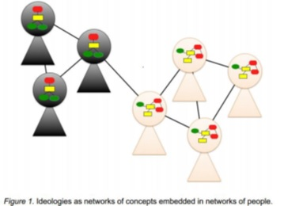
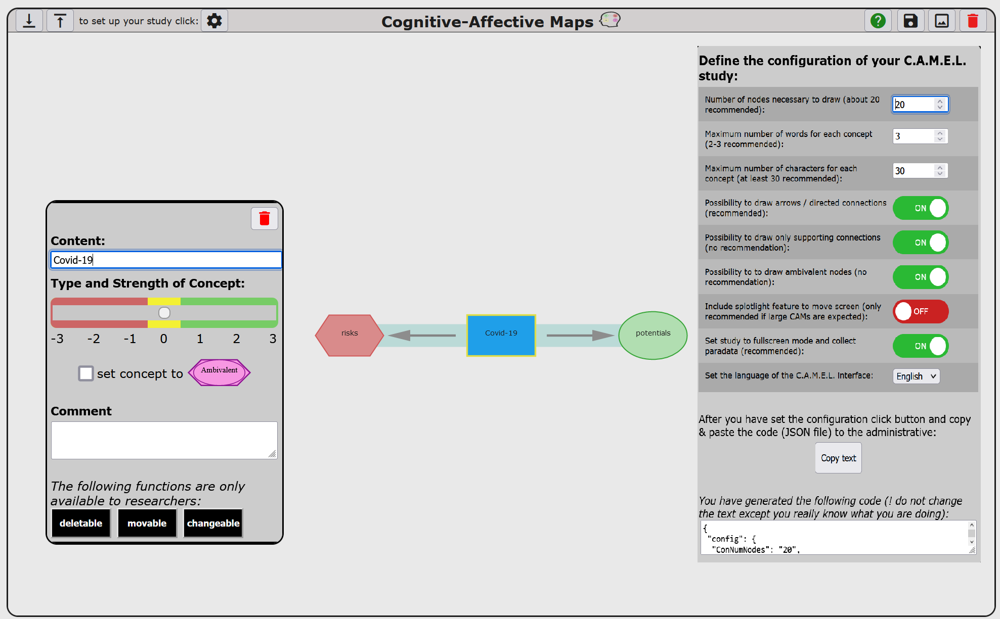
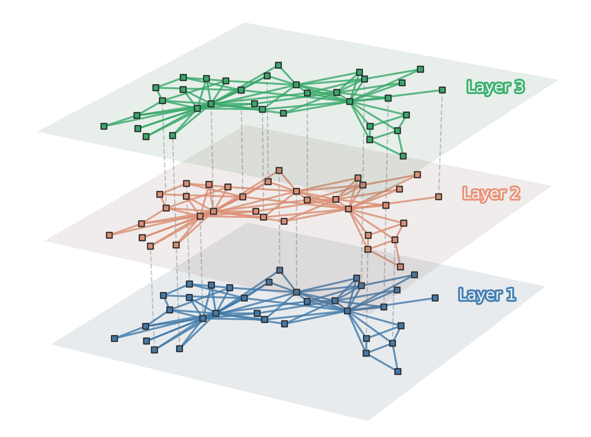

```{css, echo=FALSE}
.scrollChunk {
  max-height: 450px;
  overflow-y: auto;
  background-color: inherit;
}

.title-slide{
  /*background-color: #0000CC;*/
}

.cite {
position: absolute; 
bottom: 0; 
right: 0;
}
```

```{r setup, include=FALSE, message = FALSE, warning=FALSE}
options(htmltools.dir.version = FALSE)
# library(fontawesome)

################
# Packages
################
# if packages are not already installed, the function will install and activate them
usePackage <- function(p) {
  if (!is.element(p, installed.packages()[,1]))
    install.packages(p, dep = TRUE)
  require(p, character.only = TRUE)
}

usePackage("stargazer") # create tables

usePackage("tidyverse")

usePackage("DT")

usePackage("RefManageR")

usePackage("meta")

usePackage("lsa")

usePackage("mvtnorm")


################
# Data Bib file
################
BibOptions(check.entries = FALSE, bib.style = "authoryear", style = "markdown",
           dashed = TRUE, longnamesfirst=FALSE, max.names=1)
# file.name <- system.file("Bib", "biblatexExamples.bib", package = "RefManageR")
file.name <- "LibrarySubset.bib"
bib <- ReadBib(file.name)

################
# Data
################
# load data

setwd("data/metaAnalysis")
files_xlsx <- list.files(path = getwd(), pattern = "*.xlsx", full.names = FALSE)


list_NetworkParams <- list(); h=1
for(f in files_xlsx){
  tmp_name <- str_remove_all(string = f, pattern = "CAMindicator_|\\.xlsx")
  tmp_dat <-  xlsx::read.xlsx2(file = f, sheetIndex = 1)


  list_NetworkParams[[tmp_name]] <- tmp_dat

  tmp_dat$group <- tmp_name
  if(h==1){
    allstudies <- tmp_dat
  }else{
    allstudies <- rbind(allstudies, tmp_dat)
  }

  h=h+1
}

allstudies <- as.data.frame(allstudies)
allstudies$X. <- NULL
allstudies$CAM_ID <- NULL
allstudies$participantCAM <- NULL


allstudies[, 1:26] <- as.data.frame(sapply(allstudies[, 1:26], as.numeric))
```


```{r setup2, include=FALSE, message = FALSE, warning=FALSE}
########################################
# load packages
########################################
library(shiny)
# library(shinyWidgets)
library(shinyjs)


# library(shinycssloaders) %>% withSpinner(color="#0dc5c1")

library(tidyverse)


library(rjson) # write JSON files


library(igraph)

library(stats)
# library(sortable)

library(heatmaply)

library(psych)

########################################
# Daten
########################################
# create files
source("functions_CAM/create_CAMfiles.R", encoding = "utf-8")
source("functions_CAM/create_ValenceFiles.R", encoding = "utf-8")
# > fix Valence data
source("functions_CAM/fix_ValenceData.R", encoding = "utf-8")


# draw CAMs
source("functions_CAM/draw_CAM.R", encoding = "utf-8")

# compute network indicators
source("functions_CAM/compute_indicatorsCAM.R", encoding = "utf-8")


# helper functions for protocol
source("functions_CAM/protocolFunctions.R", encoding = "utf-8")


# create wordlist
source("functions_CAM/create_wordlist2.R", encoding = "utf-8")


setwd("heatmap_data")
# protocol <- jsonlite::read_json(path = "protocol.txt")
protocol <- rjson::fromJSON(file = "protocol.txt")


CAMfiles = list()
# readLines("CAM_nodes_raw.txt")
CAMfiles[[1]] <- vroom::vroom(file = "CAM_nodes_raw.txt", delim = "\t",
                              show_col_types = FALSE)
CAMfiles[[2]] <- vroom::vroom(file = "CAM_connectors_raw.txt", delim = "\t",
                              show_col_types = FALSE)
CAMfiles[[3]] <- vroom::vroom(file = "CAM_merged_raw.txt", delim = "\t",
                              show_col_types = FALSE)

CAMfiles[[1]]$text_summarized <- CAMfiles[[1]]$text
tmp_out <- overwriteTextNodes(protocolDat = protocol, nodesDat = CAMfiles[[1]])
CAMfiles[[1]]$text_summarized <- tmp_out[[1]]$text_summarized

##################################


###### CONFIG ######
showOnlySignificant <- TRUE #If TRUE, only those concepts are shown in the heatmap, that correlate significantly with at least one other variable
levelOfSignicifance <- 0.05
useSummarized <- FALSE #If TRUE, heatmap/correlation is calculated based on summarized concepts, if false, raw (not-summarized) concepts are used
binaryCorr <- FALSE #If TRUE, Phi correlation is used and the co-occurrence of concepts is analyzed dichotomously (i.e. concept A and B occur together in same CAM), if FALSE, number of occurences of a concept within a CAM are counted and Pearson correlations calculated
interactiveDots <- TRUE #Only important for interactive heatmap. Uses dots in the heatmap which vary in size according to p value
####################

### Input data ###
CAMsConsInput <- CAMfiles[[1]]


################
# Functions for analyzing correlation of occurence of concepts
################

### create (and return) data frame of concepts per CAM (column) from CAM-data
listConcepts <- function(datCAM = CAMfiles[[1]], useSummarized = TRUE, removeSuffix = TRUE){

  if(removeSuffix) {
    datCAM$text_summarized <-
      str_remove(string = datCAM$text_summarized , pattern = "_positive$|_negative$|_neutral$|_ambivalent$")

  }

  conceptList <- list()
  for(i in unique(datCAM$CAM)) {
    if (useSummarized == TRUE) {
      concepts <- unlist(datCAM[datCAM$CAM == i, "text_summarized"])
    } else {
      concepts <- unlist(datCAM[datCAM$CAM == i, "text"])
    }
    conceptList[[i]] <- concepts
  }
  conceptsDF <- data.frame(lapply(conceptList, "length<-", max(lengths(conceptList))))
  rownames(conceptsDF) <- NULL
  return(conceptsDF)
}


# tmp_listConcepts <- listConcepts(datCAM = CAMsConsInput, useSummarized = TRUE, removeSuffix = TRUE)
# head(tmp_listConcepts)


### Takes a data frame the concepts mentioned in the CAMs (one CAM one column)
### Returns a data frame with all concepts mentioned in more than one CAM (columns "concept") and the number of CAMS where it occurs (column "numCAMoccurences")
countDuplicates <- function(concepts = conceptsDF, oderFrequency = FALSE){
  allCons <- c()

  for(i in 1:ncol(concepts)) {       # for-loop over columns
    CAMcons <- unlist(concepts[ , i], use.names=FALSE)
    allCons <- append(allCons,unique(CAMcons))
  }

  duplicateCons <- names(table(allCons))[table(allCons) >=2]


  duplicateDF <- matrix(nrow = length(duplicateCons), ncol = 2)
  for(i in 1:length(duplicateCons)) {
    duplicateDF[i,] = c(duplicateCons[i], sum(allCons==duplicateCons[i], na.rm=TRUE))
  }
  colnames(duplicateDF) = c("concept","numCAMoccurences")
  duplicateDF <- as.data.frame(duplicateDF)
  duplicateDF$numCAMoccurences <- as.numeric(duplicateDF$numCAMoccurences)


  if( oderFrequency ) {
    duplicateDF <- duplicateDF[order(duplicateDF$numCAMoccurences, decreasing = TRUE),]
  }

  return(duplicateDF)
}

# tmp_countDuplicates <- countDuplicates(concepts = tmp_listConcepts, orderFrequency = TRUE)
# head(tmp_countDuplicates)

## Creating a Table with binary encoding for duplicate concepts. I.e., each concept mentioned more than once is a column, each CAM is a row.
# If the concept is mentioned in the respective CAM, cell is 1, if not cell is 0
binaryEncoding <- function(conDF = conceptsDF, duplDF = duplicateDF) {
  binaryDF <- data.frame(matrix(nrow = ncol(conDF), ncol = length(duplDF$concept))) # Create an empty dataframe where each column is going to represent a concept and each row a CAM
  colnames(binaryDF) <- duplDF$concept #Name the columns of the dataframe according to the list of concepts occurring more than once
  binaryDF[is.na(binaryDF)] <- 0

  rownames(binaryDF) <- colnames(conDF)

  for(r in 1:nrow(binaryDF)){
    binaryDF[rownames(binaryDF)[r],] <- as.numeric(duplDF$concept %in% conDF[, rownames(binaryDF)[r]])
  }

  return(binaryDF)
}


# tmp_binaryEncoding <- binaryEncoding(conDF = tmp_listConcepts, duplDF = tmp_countDuplicates)
# head(tmp_binaryEncoding)


## Creating a Table with metric encoding for duplicate concepts. I.e., each concept mentioned more than once is a column, each CAM is a row.
# If the concept is mentioned in the respective CAM, cell is X, whereby X is the number of occurrence of concepts in the respective CAM if not cell is 0
# conDF = conceptsDF
# duplDF = duplicateDF
metricEncoding <- function(conDF = conceptsDF, duplDF = duplicateDF) {
  metricDF <- data.frame(matrix(nrow = 0, ncol = length(duplDF$concept))) # Create an empty dataframe where each column is going to represent a concept and each row a CAM
  colnames(metricDF) <- duplDF$concept #Name the columns of the dataframe according to the list of concepts occuring more than once
  #rownames(binaryDF) <- duplDF$concept
  CAMs <- colnames(conDF)
  for(CAM in CAMs) {
    metricVec <- c() #Create an empty vector that is going to be filled with the number of occurrence of concepts in the respective CAM
    for(concept in duplDF$concept) { #For each concept count how often it is mentioned in the respective CAM
      metricVec <- append(metricVec, length(which(conDF[[CAM]] == concept)))
    }
    metricDF[nrow(metricDF) + 1,] = metricVec #Append the vector as a row to binaryDF
    rownames(metricDF)[nrow(metricDF)] <- CAM #Name the respective row by the ID of the CAM it represents
  }

  return(metricDF)
}

# tmp_metricEncoding <- metricEncoding(conDF = tmp_listConcepts, duplDF = tmp_countDuplicates)
# head(tmp_metricEncoding)
# tmp_metricEncoding[rownames(tmp_metricEncoding) %in% rownames(tmp_metricEncoding)[tmp_metricEncoding$`risks for health` >= 2], ]
# sum(tmp_metricEncoding >= 2)


## Calculates Phi coefficient and p-value (chi-square) and returns both in a vector
phiCoefficient <- function(var1, var2) {
  crosstab <- table(factor(var1, levels=c(0,1)), factor(var2, levels=c(0,1)))
  chisqTest <- stats::chisq.test(crosstab, correct = FALSE)
  sig <- chisqTest$p.value
  a <- crosstab[1, 1]
  b <- crosstab[1, 2]
  c <- crosstab[2, 1]
  d <- crosstab[2, 2]
  ad <- a * d
  bc <- b * c
  phi <- (ad - bc) / sqrt((a + b) * (c + d) * (a + c) * (b + d))

  ## return earlier is phi is nan (divide by 0)
  if(is.nan(x = phi)){
    # print(phi)
    # print(crosstab)
    return(c(NA, NA))
  }

  if(round(x = phi, digits = 5) != psych::phi(t = crosstab, digits = 5)){
    print("possible ERROR in phi computation")
  }
  return(c(phi, sig))
}


## Calculates pearson coefficient and p-value and returns both in a vector
pearsonCoefficient <- function(var1, var2) {
  correl <- cor.test(var1, var2)
  sig <- correl$p.value
  #print(typeof(correl$estimate))
  r <- correl$estimate
  return(c(r, sig))
}


## Calculates Cohens Kappa
cohensKappa <- function(var1, var2) {

  outCohen <- irr::kappa2(cbind(var1, var2))

  sig <- outCohen$p.value
  r <- outCohen$value

  return(c(r, sig))
}


## Builds a list that contains two Dataframes: one that contains the correlation coefficients for the pairwise co-occurence of all concepts and one the respective p-values
# args
# conList = duplicateDF
# inputTable =  binaryDf
# CorrFUNC = cohensKappa # pearsonCoefficient, phiCoefficient
# considerValence = TRUE
# datNodes = CAMfiles[[1]]

correlationTable <- function(conList = duplicateDF,
                             inputTable = binaryDf,
                             CorrFUNC,
                             considerValence = TRUE,
                             datNodes = NULL) {

  if(considerValence){
    ## update inputTable df by valence ratings
    datNodes$text_summarized <-
      str_remove(string = datNodes$text_summarized , pattern = "_positive$|_negative$|_neutral$|_ambivalent$")
    datNodes$value <- ifelse(test = datNodes$value == 10, yes = 0, no = datNodes$value)

    for(r in 1:nrow(inputTable)){
      tmp_CAMid <- str_remove(string = rownames(inputTable)[r], pattern = "^X")
      tmp_CAMid <- str_replace_all(string = tmp_CAMid, pattern = "\\.", replacement = "-")

      tmp_datNodes <- datNodes[datNodes$CAM == tmp_CAMid,]

      for(c in 1:ncol(inputTable)){
        if(inputTable[r,c] == 1){
          tmp_value <- tmp_datNodes$value[tmp_datNodes$text_summarized %in% colnames(inputTable)[c]]

          if (mean(tmp_value) > 0){
            inputTable[r,c] <- "positive"
          }else if (mean(tmp_value) < 0){
            inputTable[r,c] <- "negative"
          } else {
            inputTable[r,c] <- "neutral"
          }
        }
      }
    }

    # error message if no overlapping words
    # for(c in 1:ncol(inputTable)){
    #   inputTable[,c] <- factor(inputTable[,c], levels=c("positive","negative","neutral"))
    # }
  }


  ## set up data frames
  mat_est <- matrix(data = NA, nrow = length(conList$concept), ncol = length(conList$concept))
  mat_p <- matrix(data = NA, nrow = length(conList$concept), ncol = length(conList$concept))

  for(r in 1:length(conList$concept)) {
    # print(r)
    for(c in 1:length(conList$concept)) {
      # print(c)

      if(r == c){
        mat_est[r, c] <- 1  # add estimate (main diagonal always 1)
        mat_p[r, c] <- 0 # add p-value
      }else if(r < c){
        newCell <- CorrFUNC(var1 = inputTable[, r],
                            var2 = inputTable[, c])
        # add estimate (phi or corr)
        mat_est[r, c] <- newCell[1]
        mat_est[c, r] <- newCell[1]
        # add p-value
        mat_p[r, c] <- newCell[2]
        mat_p[c, r] <- newCell[2]
      }
    }
  }

  rownames(mat_est) <- conList$concept
  colnames(mat_est) <- conList$concept

  rownames(mat_p) <- conList$concept
  colnames(mat_p) <- conList$concept


  return(list(mat_est, mat_p))
}


## Calling functions defined above in oder to calculate correlation coefficients and p-values for all concept pairings
conceptsDF <- listConcepts(CAMsConsInput, useSummarized = TRUE,
                           removeSuffix = TRUE)
duplicateDF <- countDuplicates(concepts = conceptsDF, oderFrequency = TRUE)
binaryDf <- binaryEncoding(conDF = conceptsDF, duplDF = duplicateDF)
# metricDF <- metricEncoding(conceptsDF, duplicateDF)


CorrSigTables <- correlationTable(conList = duplicateDF,
                                  inputTable =  binaryDf, # metricDF
                                  CorrFUNC = phiCoefficient, considerValence = FALSE,
                                  datNodes = CAMfiles[[1]])


CorrSigTables <- correlationTable(conList = duplicateDF,
                                  inputTable =  binaryDf, # metricDF
                                  CorrFUNC = cohensKappa, considerValence = TRUE,
                                  datNodes = CAMfiles[[1]])
names(CorrSigTables) <- c('coefficient', 'p')


## Extracting separate matrices for correlation coefficients and p values and filtering out rows/columns with NA only ##
coefficientMatrix <- as.matrix(CorrSigTables[["coefficient"]])
coefficientMatrix <- coefficientMatrix[rowSums(!is.na(coefficientMatrix))>1,
                                       colSums(!is.na(coefficientMatrix))>1]
pMatrix <- as.matrix(CorrSigTables[["p"]])
pMatrix <- pMatrix[rowSums(!is.na(pMatrix))>1,
                   colSums(!is.na(pMatrix))>1]

## Filter matrices such that only concepts with at least one significant correlation (apart from autocorrelation) remain
if(showOnlySignificant == TRUE) {
  coefficientMatrix <- coefficientMatrix[(rowSums(pMatrix <= levelOfSignicifance) > 1), (colSums(pMatrix <= levelOfSignicifance) > 1)]
  pMatrix <- pMatrix[(rowSums(pMatrix <= levelOfSignicifance) > 1), (colSums(pMatrix <= levelOfSignicifance) > 1)]
}


## Creating a combined matrix with coefficients and p values for output
coefficientVec <- paste0(round(coefficientMatrix,3))
pVec <- paste0(round(pMatrix,3))
combinedMatrix <- matrix(paste0(coefficientVec, " (p=", pVec, ")"), ncol = ncol(coefficientMatrix))
colnames(combinedMatrix) <- rownames(combinedMatrix) <- colnames(coefficientMatrix)


### Preparing interactive heatmap (see comments below, if this causes problems in shiny)
if(interactiveDots){
  nodeType = "scatter"
} else {
  nodeType = "heatmap"
}


interactiveHeatmap <- heatmaply_cor(
  coefficientMatrix,
  node_type = nodeType,
  point_size_mat = -log10(pMatrix),
  point_size_name = "-log10(p-value)",
  xlab = "Concepts",
  ylab = "Concepts",
  k_col = 2,
  k_row = 2,
  label_names = c("x", "y", "Correlation"),
  width = 1000,
  height = 1000
)
```


<!-- *********** NEW SLIDE ************** -->

## Table of Contents

Three parts:

1 Cognitive-Affective Maps
  + our team, CAMs
  + motivation, current work and future challenges

2 Cognitive-Affective Maps *extended logic*
  + data collection, adaptive designs
  
3 CAM-App
  + pre-processing step
  + analysis step


<br>
<br>
 
.pull-left[
if you want to download the slides / R Code: https://github.com/FennStatistics/CAMtools_workshops
]

.pull-right[

<center>

</center>

]


<!-- *********** HEADING ************** -->
---
class: heading,middle


Part 1: Cognitive-Affective Maps (CAMs)


<!-- *********** HEADING ************** -->
---
class: heading,middle


> our team, CAMs


<!-- *********** NEW SLIDE ************** -->
---
## our CAM team (a subset)

<center>

</center>

> research / CAM tools development build up on [Lisa Reuter's disseration](https://www.psychologie.uni-freiburg.de/Members/lreuter/Reuterdiss)


<!-- *********** NEW SLIDE ************** -->
---
## CAMs

CAMs as a quantitative and qualitative research method first became popular through [Paul Thagard](https://paulthagard.com/); possible to identify and visually represent any kind of declarative knowledge:


<center>

</center>


`r Citet(bib, c("sendtner_kostbare_2021", "thagard_empathica_2010"))`; data collection tool: [C.A.M.E.L.](https://camgalaxy.github.io/?ShowResearcherButtons=false&fullScreen=false)


<!-- *********** NEW SLIDE ************** -->
---
## CAMs - fundamental hypothesis 

**Hypothesis**: The generation process of CAMs is not arbitrary, but is determined by multiple processes at multiple levels, and thus CAMs from similar individuals on an identical topic exhibit systematically similar structures (similar data generating process)

* can be presented by a „emergent product of interaction between networks of mental representations at the individual level and networks of social communication at the group level“


<center>

</center>


> if stochasticity is ubiquitous in **complex networks**, these networks are not maximally random either; rather, they obey organization principles that make them functional


`r Citet(bib, c("bianconi_multilayer_2018", "homer-dixon_complex_2013"))`


<!-- *********** HEADING ************** -->
---
class: heading,middle


> motivation, current work and future challenges


<!-- *********** NEW SLIDE ************** -->
---
## motivating overall goal

*  **ethical assessment of emerging technologies in real-time**, e.g. climate engineering technologies


.pull-left[

> to guide society towards environmentally sustainable management during the era of the Anthropocene [...] will require appropriate human behaviour at all scales, and may well **involve internationally accepted, large-scale geo-engineering projects**, for instance to ‘optimize’ climate.

by `r Citet(bib, c("crutzen_geology_2002"))`
]

.pull-right[
<center>

</center>
]

<br>
-> huge investments by private and public sector, e.g. [Office of Fossil Energy and Carbon Management investing $2.52 billion to fund two carbon capture programs ](https://content.govdelivery.com/accounts/USDOEOFE/bulletins/3454f32)


<!-- *********** NEW SLIDE ************** -->
---
## motivating overall goal - study design and statistical procedures

for the ethical assessment of emerging technologies in real-time is needed: 


.pull-left[
**a complex study design,**

<center>

</center>

]

.pull-right[
**which relates heterogeneous data sources**

<center>

</center>

]


[Fenn, et al. (submitted revision)](#bib1);
[Fenn, et al. (re-submitted next week)](#bib2);
[Fenn, et al. (in preparation)](#bib3)


<!-- *********** NEW SLIDE ************** -->
---
## current work

by analyzing the content of CAMs
* CAMs offer added value compared to a survey, as the latter can only consider pre-identified influential factors
* CAMs allow to identify similar concerns as more time consuming interview / focus group based methods - [Fenn, et al. (submitted revision)](#bib1); `r Citet(bib, c("reuter_direct_2022"))`

<br>
by using CAMs for experimental and correlation studies 
* CAMs have been used for intervention, e.g. mediation `r Citet(bib, c("gros_camediaid_2021"))` or cost intervention `r Citet(bib, c("sendtner_kostbare_2021"))`
* correlations between CAMs’ emotional properties and latent properties and survey scales - `r Citet(bib, c("mansell_measuring_2021", "mansell_novel_2021"))`


<!-- *********** NEW SLIDE ************** -->
---
## (future) challenges of using CAMs


* compared to surveys low test economy (> 30 minutes CAM part)
* low standardization 
* construct validity not shown (how to test?)

<br>
* reliability first attempts (re-test reliability $>.7$)


<br>
<br>
How to critically reflect CAMs???

* by classical test theory criteria (objectivity, reliability, validity, test economy, usefulness, fairness,..)
* in comparison to other mental model tools
* in their capabilities to predict external criteria (~ network similarity)
* ...


<!-- *********** HEADING ************** -->
---
class: heading,middle


Part 2: Cognitive-Affective Maps *extended logic*


<!-- *********** HEADING ************** -->
---
class: heading,middle


> data collection, adaptive designs


<!-- *********** NEW SLIDE ************** -->
---
## C.A.M.E.L.

**Cognitive-Affective Map Extended Logic** (C.A.M.E.L. 🐪) is an open-source software to draw Cognitive-Affective Maps. It aims to offer people an easy and intuitive interface on which they could drawn their own mind map that can be analysed by researchers


.pull-left[
*researcher view*

<center>

</center>

]

.pull-right[
*participant view*

<center>

</center>

]


<!-- *********** NEW SLIDE ************** -->
---
## C.A.M.E.L. - features

.pull-left[
*researcher view*

<center>

</center>

]

.pull-right[
*possible options*

* possible to create, position and fix (i.e., impossibility to move a concept) elements
* switch languages
* enable / disable certain features

<br>
see in detail documentation: https://camtools-documentation.readthedocs.io/en/master/Cognitive-Affective%20Map%20extended%20logic/#define-your-config-file
]

<br>
try it out: [maximum settings](https://camgalaxy.github.io/?cameraFeature=true&fullScreen=true&ShowResearcherButtons=true&hideArrows=false&hideAmbivalent=false&showSliderAgreementOnly=false); [minimal settings](https://camgalaxy.github.io/?cameraFeature=false&fullScreen=false&ShowResearcherButtons=false&hideArrows=true&hideAmbivalent=true&showSliderAgreementOnly=true)


<!-- *********** NEW SLIDE ************** -->
---
## C.A.M.E.L. - overview of features 

*Parameter you can change using the user researcher view:*

<center>

</center>


<!-- *********** NEW SLIDE ************** -->
---
## adaptive designs

e.g. by sending the CAM JSON object between components of a study (e.g. session data capabilities of JATOS) it is possible to set up adaptive designs, e.g. for intervention studies: 

<center>

</center>


> possible to implement sequential collaboration (event file is created)


and to analyze the CAM data in real-time to adaptively ask questions using [Cytoscape.js](https://js.cytoscape.org/)


<br>
try it out: adaptive study design (simply draw 2 concepts with pos. / neg. valence and connect them and click on disk symbol to save): https://studien.psychologie.uni-freiburg.de/publix/gv3Q8UvdRLu 
 
 
 
<!-- *********** HEADING ************** -->
---
class: heading,middle


Part 3: CAM-App


<!-- *********** NEW SLIDE ************** -->
---
## structure of CAM data

A CAM (graph) is in general defined by: 
$$ G = (V, E)$$
, whereby V = set of vertices, E = set of edges. The vertices also contain emotional information (valence; *hot cognition*, *HOTCO*, ...), which leads to the following network properties:


.pull-left[

**emotional properties**
<br>
measure how the valence of individual nodes contributes to the overall CAM (Average Valence, Percentage of each node type, <span style="color:blue">Central Node Valence</span>, ...)

]

.pull-right[

**latent properties**
<br>
refer to the number of nodes, links, and their interconnectedness (Centrality, Density, Diameter, Number of Nodes, Number of Links, Triadic Closure, ...)

]

> remark: it would also be possible to include position information (x, y) of drawn nodes and number of changes / movements (event log)


<br>
using similar terminology as `r Citet(bib, c("mansell_novel_2021", "mansell_measuring_2021"))`


<!-- *********** NEW SLIDE ************** -->
---
## Example CAMs


.pull-left[

**low density, high assortativity**
<center>

</center>

]

.pull-right[

**high density, low assortativity**
<center>

</center>

]


<!-- *********** NEW SLIDE ************** -->
---
## CAM-App - two steps

logic of the CAM-App follows the principle of a classical data-analysis pipeline


.pull-left[


see: `r Citet(bib, c("peng_art_2016", "wickham_r_2017"))`

<br>
https://fennapps.shinyapps.io/shinyCAMEL_v02/


]

.pull-right[

composed of two steps:
<br>
**pre-processing step**

CAM data is often messy and the number of unique concepts drawn is in general quite huge, e.g.

*Following the five-step procedure, the 1063 unique concepts (1473 in total) were reduced to 52 concepts (see detailed list of the 52 concepts in D in the online supplementary; https://osf.io/vb5qe)* - [Fenn, et al. (submitted revision)](#bib1)

<br>
<br>
**analysis step**

* word lists / word clouds
* co-occurrence maps
* aggregate CAM
* network indicators
* network similarity (! in development)
* ...

]


<!-- *********** NEW SLIDE ************** -->
---
## CAM-App - implemented functions

.pull-left[
**pre-processing step**

1.	Import/Upload data
2.	Draw CAMs
3.	Approximate matching
4.	Searching terms
5.	Search for synonyms
6.	Apply word2vec model
7.	Overview of non-summarized concepts
8.	Compute inter-rater reliability
9.	Train raters for summarizing of concepts


]

.pull-right[
**analysis step**

1.	Import/Upload data
2.	Draw CAMs
3.	Compute network indicators
4.	Compute neighborhood indicators
5.	Compute descriptive statistics on network indicators
6.	Create wordlist
7.	Create wordcloud
8.	Get table, pie chart
9.	Get summary statistics
10.	Aggregate CAMs
11.	Concept co-occurrences
12.	Valence co-occurrences
13.	Similarity Algorithms
14.	Slice CAMs
15.	Get summary statistics
16.	Get Report

]


> functionalities are based on 31 R functions, Python code divided in 28 modules (server, UI seperated)


<!-- *********** HEADING ************** -->
---
class: heading,middle


> pre-processing step


<!-- *********** NEW SLIDE ************** -->
---
## reduce number of unique concepts

* Approximate matching: closeness of two concepts is measured in terms of the number of primitive operations necessary to convert the concept into an exact match (e.g. substitution: coat -> cost)
* Searching terms: using regular expressions

<br>

* Search for synonyms: automatically searching for synonyms in a dictionary (Reverso)
* Apply word2vec model: automatically generating suggestions for clustering and summarizing concepts according to semantic similarity between concepts
  + Categories of words found by word2vec:


<center>

</center>


<!-- *********** HEADING ************** -->
---
class: heading,middle


> analysis step (3 examples)


<!-- *********** NEW SLIDE ************** -->
---
## aggregate CAMs - multilayer networks


Multilayer networks are defined by:

$$ G = (V, E, D)$$

, whereby D is a set of dimensions (or layers = CAMs). 

<center>

</center>


e.g. `r Citet(bib, c("bianconi_multilayer_2018", "domenico_multilayer_2022"))`


<!-- *********** NEW SLIDE ************** -->
---
## Example - aggregated CAM

to highlight the inter-relatedness of all summarized concepts, the CAMs (between X groups) can be aggregated by creating a so-called *“canonical adjacency matrix”*; example of 58 summarized CAMs: 

<center>

</center>

[Fenn, et al. (submitted revision)](#bib1)


<!-- *********** NEW SLIDE ************** -->
---
## Slice CAMs


*If you have a CAM structure, which can be separated (e.g. pre-defined opposing concepts) the CAMs can be automatically sliced according to two possible criteria: (a) delete a connection between two concepts, or (b) delete a concept. Automatically the CAM changed this way is checked according to multiple criteria (e.g. number of expected network components) to validate the slicing process.*


<center>

</center>


<!-- *********** NEW SLIDE ************** -->
---
## Concept co-occurrences

*Computing the concept-co-occurrences between all CAMs by setting up multiple contingency tables, followed by computing the phi coefficient, groups of concepts with similar concept-co-occurrences in CAMs are identified.*


```{r, message = FALSE, warning=FALSE}
interactiveHeatmap %>% plotly::layout(height=500,width=1000)
```


<!-- *********** NEW SLIDE ************** -->
---
## in few weeks visit our website


.pull-left[

future website: http://drawyourminds.de

<br>
Feel free to send me an email at any time: <cam.contact@drawyourminds.de>

]

.pull-right[

<center>

</center>

]


<br>
<br>
<center>
Thanks all my collaborators and Andrea for her great support! 
</center>


<!-- *********** NEW SLIDE ************** -->
---
## CAMs are growing... 


.pull-left[


we have collected over 1000 CAMs within scientific studies!

<center>

</center>


all available CAM data sets collected: https://github.com/FennStatistics/CAMdatasets

]

.pull-right[

and 6000 CAMs more to come:

currently we writing a registered report to be submitted in *Nature Human Behaviour*

* 12 countries x 500 CAMs each


<center>

</center>

(USA, Mexico, Brazil, Russia, Australia, Germany, Switzerland, India, Israel, China, Japan, South Africa)

]


<br>
<br>
<br>
<br>
<br>
<br>
`r Citet(bib, c("fenn_empirical_2022", "fennIdentifyingKeyPsychologicalFactors2022", "fennDatadrivenMultiMethodApproachIdentifying2023"))`


<!-- *********** NEW SLIDE ************** -->
---
## References I

```{r, results='asis', echo=FALSE}
PrintBibliography(bib, start = 1, end = 5)
```


<!-- *********** NEW SLIDE ************** -->
---
## References II

```{r, results='asis', echo=FALSE}
PrintBibliography(bib, start = 6, end = 10)
```


<!-- *********** NEW SLIDE ************** -->
---
## References III

```{r, results='asis', echo=FALSE}
PrintBibliography(bib, start = 11, end = 15)
```


<!-- *********** NEW SLIDE ************** -->
---
## precondition for aggregating CAMs: number of unique concepts need to be lower than X

**Problem:** if too many unique concepts are in a CAM data set there is hardly any overlap between CAMs 

<br>
<br>
**reduce number of unique concepts**

*Following the five-step procedure, the 1063 unique concepts (1473 in total) were reduced to 52 concepts (see detailed list of the 52 concepts in D in the online supplementary; https://osf.io/vb5qe)* - see [Fenn, et al. (submitted revision)](#bib1)

<br>
**by following a five-step procedure**:

Possible sequence how to summarize CAMs on a semantic / qualitative level: https://docs.google.com/document/d/18E-DYbixLiQw_P23uSJx-A6oOZo1FmNqGv91-QM-Pes/edit?usp=sharing

which was informed by

* qualitative procedures, especially content analysis
* semantic network analysis literature


<!-- *********** NEW SLIDE ************** -->
---
## Side-note: identifying sub-groups

Similarity Matrix to identify specific subgroups of people within single CAM studies:


```{r, echo=FALSE}
set.seed(seed = 123)
sigma <- matrix(data = 
              c(4,3,3,1,1,1,
                3,4,3,1,1,1,
                3,3,4,1,1,1,
                1,1,1,4,2,1,
                1,1,1,2,4,1,
                1,1,1,1,1,4), ncol=6)
# cov2cor(V = sigma)
simMat <- rmvnorm(n=5000, mean=c(rep(1, times=6)), sigma=sigma)
simMat <- round(x = cor(simMat), digits = 2)
colnames(simMat) <- c(rep("CC TRUE", times=3), rep("CC FALSE", times=2), "the undecided guy")
rownames(simMat) <- c(rep("CC TRUE", times=3), rep("CC FALSE", times=2), "the undecided guy")
```

.pull-left[

**Similarity Matrix**: 

.scrollChunk[
```{r}
simMat
```
]


]
.pull-right[

**Hierarchical Clustering**: 

```{r, echo=TRUE, fig.dim = c(12, 6), dpi=600}
cosine_sim <- 1-as.dist(simMat) # create similarity  using euclidean distance
cluster1 <- hclust(cosine_sim, method = "ward.D2") # Ward's method
plot(cluster1)
```
]

> e.g. identify CAMs of people who belief / disbelief in climate change
