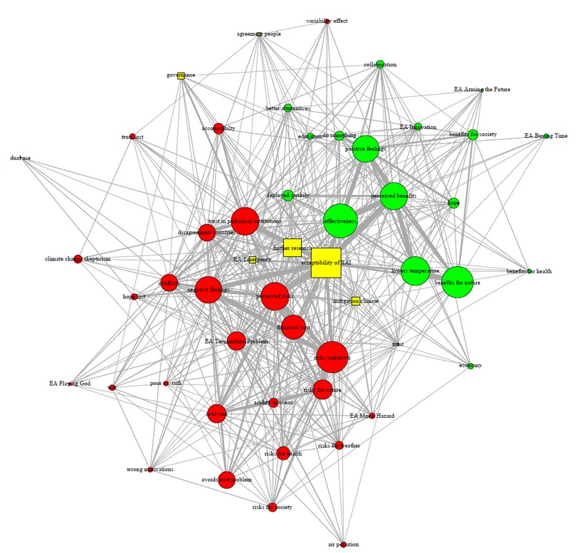

```{css, echo=FALSE}
.scrollChunk {
  max-height: 450px;
  overflow-y: auto;
  background-color: inherit;
}

.cite {
position: absolute; 
bottom: 0; 
right: 0;
}
```

```{r setup, include=FALSE, message = FALSE, warning=FALSE}
options(htmltools.dir.version = FALSE)
# library(fontawesome)

################
# Packages
################
# if packages are not already installed, the function will install and activate them
usePackage <- function(p) {
  if (!is.element(p, installed.packages()[,1]))
    install.packages(p, dep = TRUE)
  require(p, character.only = TRUE)
}

usePackage("stargazer") # create tables

usePackage("tidyverse")

usePackage("DT")

usePackage("RefManageR")

usePackage("meta")

usePackage("lsa")

usePackage("mvtnorm")


################
# Data Bib file
################
BibOptions(check.entries = FALSE, bib.style = "authoryear", style = "markdown",
           dashed = TRUE, longnamesfirst=FALSE, max.names=1)
# file.name <- system.file("Bib", "biblatexExamples.bib", package = "RefManageR")
file.name <- "LibrarySubset.bib"
bib <- ReadBib(file.name)

################
# Data
################
# load data

setwd("data/metaAnalysis")
files_xlsx <- list.files(path = getwd(), pattern = "*.xlsx", full.names = FALSE)


list_NetworkParams <- list(); h=1
for(f in files_xlsx){
  tmp_name <- str_remove_all(string = f, pattern = "CAMindicator_|\\.xlsx")
  tmp_dat <-  xlsx::read.xlsx2(file = f, sheetIndex = 1)


  list_NetworkParams[[tmp_name]] <- tmp_dat

  tmp_dat$group <- tmp_name
  if(h==1){
    allstudies <- tmp_dat
  }else{
    allstudies <- rbind(allstudies, tmp_dat)
  }

  h=h+1
}

allstudies <- as.data.frame(allstudies)
allstudies$X. <- NULL
allstudies$CAM_ID <- NULL
allstudies$participantCAM <- NULL


allstudies[, 1:26] <- as.data.frame(sapply(allstudies[, 1:26], as.numeric))
```


<!-- *********** NEW SLIDE ************** -->

## Table of Contents

Three parts:

1 CAM tools
  + overview
  + motivate CAMs (highlights)
  + working group, list of literature
  
2 How to set up a CAM study
  + pros and cons
  
3 How to analyze the resulting CAM data


<br>
 
.pull-left[
if you want to download the slides: https://github.com/FennStatistics/CAMtools_workshops
]

.pull-right[

<center>

</center>

]


<!-- *********** HEADING ************** -->
---
class: heading,middle


Part 1: CAM tools


<!-- *********** HEADING ************** -->
---
class: heading,middle


Part 1: CAM tools - overview


<!-- *********** NEW SLIDE ************** -->
---
## already done - C.A.M.E.L. I

we (Julius & Florian) developed **Cognitive-Affective Map Extended Logic** (C.A.M.E.L. 🐪) , which is an open-source software to draw Cognitive Affective Maps. It aims to offer people an easy and intuitive interface on which they could design mind map that can be analysed by researchers.


.pull-left[
*researcher view*

<center>

</center>

]

.pull-right[
*participant view*

<center>

</center>

]

* possible to create, position and fix (i.e., impossibility to move a concept) elements
* switch languages
* enable / disable certain features


<!-- *********** NEW SLIDE ************** -->
---
## already done - C.A.M.E.L. II

.pull-left[
*researcher view*

<center>

</center>

]

.pull-right[
*possible options*

* possible to create, position and fix (i.e., impossibility to move a concept) elements
* switch languages
* enable / disable certain features

<br>
see in detail documentation: https://camtools-documentation.readthedocs.io/en/master/Cognitive-Affective%20Map%20extended%20logic/#define-your-config-file
]

<br>
try it out: [maximum settings](https://camgalaxy.github.io/?cameraFeature=true&fullScreen=true&ShowResearcherButtons=true&hideArrows=false&hideAmbivalent=false&showSliderAgreementOnly=false); [minimal settings](https://camgalaxy.github.io/?cameraFeature=false&fullScreen=false&ShowResearcherButtons=false&hideArrows=true&hideAmbivalent=true&showSliderAgreementOnly=true)


<!-- *********** NEW SLIDE ************** -->
---
## already done - CAM-App I

resulting data can be analyzed using our developed data-analysis tool **CAM-App**


.pull-left[

try it out: https://fennapps.shinyapps.io/shinyCAMEL_v02/

]

.pull-right[


]

* no coding is required to analyze resulting CAM data
  + facilitate the preprocessing of the data
  + analysis of preprocessed data


<!-- *********** NEW SLIDE ************** -->
---
## already done - CAM-App II

logic of the CAM-App follows the principle of a classical data-analysis pipeline


.pull-left[


see: `r Citet(bib, c("peng_art_2016", "wickham_r_2017"))`
]

.pull-right[

composed of two steps:
<br>
**preprocessing step**

CAM data is often messy and the number of unique concepts drawn is in general quite huge, e.g.

*Following the five-step procedure, the 1063 unique concepts (1473 in total) were reduced to 52 concepts (see detailed list of the 52 concepts in Appendix D in the online supplementary; https://osf.io/8z63x)* - see `r Citet(bib, c("fenn_identifying_2022"))`

<br>
<br>
**analysis step**

* word lists
* word clouds
* aggregate CAM
* network indicators
* network similarity (! in development)
* ...

]


<!-- *********** NEW SLIDE ************** -->
---
## already done - administrative panel (! *in development*)

**administrative panel** (linking everything)

<center>

</center>


<br>
further information see online presentation about the developed Cognitive-Affective Maps tools: https://studien.psychologie.uni-freiburg.de/publix/4ON9vgMG7Mm
<br>
current website design (not connected to API): https://camel-server.vercel.app/


<!-- *********** NEW SLIDE ************** -->
---
## already done - support


In case you are interested by using CAMs in your studies or just intrigued by their potential application in different fields, feel free to contact us, we would be happy to come in contact with you.

<br>
<br>
* Email <cam.contact@drawyourminds.de> 
* join our Slack channel (we will switch to Discord): https://join.slack.com/t/cognitiveaffe-um96332/shared_invite/zt-1cybwr0tf-u2PWQh4L3BP3tuxLuH4c5w


<!-- *********** HEADING ************** -->
---
class: heading,middle


Part 1: CAM tools - motivate CAMs (highlights)


<!-- *********** NEW SLIDE ************** -->
---
## CAMs I

CAMs as a quantitative and qualitative research method first became popular through [Paul Thagard](https://paulthagard.com/); possible to identify and visually represent any kind of declarative knowledge:


<center>

</center>


`r Citet(bib, c("sendtner_kostbare_2021", "thagard_empathica_2010"))`


<!-- *********** NEW SLIDE ************** -->
---
## CAMs II - theory

**What are CAMs?**

* CAMs are „conceptual structures that people use to represent important aspects of the world“
* „cognitive-affective map is a visual representation of the emotion values of a group of interconnected concepts“
  + this is how CAMs differ from semantic networks, because CAMs additionally contain emotions (valence)
  + hot cognition: emotions cannot be separated from cognitions
  
<br>
<br> 

**How are CAMs constructed?**

* the stepwise construction process of CAMs can be understood as a **multiple constraint satisfaction process**, where concepts, conditions, goals, etc. are mentally represented with the involvement of emotions
  + Concepts in the CAM are only changed or added if they correspond to the „most coherent account of what we want to understand“

<br>

`r Citet(bib, c("thagard_coherence_2000", "thagard_hot_2006", "thagard_cognitive_2021"))`


<!-- *********** NEW SLIDE ************** -->
---
## CAMs III - fundamental hypothesis 

**Hypothesis**: The generation process of CAMs is not arbitrary, but is determined by multiple processes at multiple levels, and thus CAMs from similar individuals on an identical topic exhibit systematic correlations (similar data generating process)

* can be presented by a „emergent product of interaction between networks of mental representations at the individual level and networks of social communication at the group level“


<center>

</center>


> if stochasticity is ubiquitous in **complex networks**, these networks are not maximally random either; rather, they obey organization principles that make them functional


`r Citet(bib, c("bianconi_multilayer_2018", "homer-dixon_complex_2013"))`


<!-- *********** NEW SLIDE ************** -->
---
## CAMs IV - fields of application

* to study if CAMs are supplementary to questionnaires -  `r Citet(bib, c("mansell_novel_2021", "mansell_measuring_2021", "fenn_identifying_2022"))`
* agent-based modelling - e.g. `r Citet(bib, c("wolf_changing_2015", "schroder_modeling_2017"))`
* use CAMs for conflict mediation - e.g. `r Citet(bib, c("gros_camediaid_2021"))`
* evaluate via CAMs the success of an intervention - e.g. `r Citet(bib, c("reuter_leisure_2021", "luthardt_and_2020"))`
* possible to compute similarity between CAMs and identify subgroups (e.g. people believing / not believing in human-driven climate change), see: `r Citet(bib, c("luthardt_quantifying_2022"))` + own current developments
* ...


<!-- *********** NEW SLIDE ************** -->
---
## CAMs V - Data Overview

.pull-left[
All available CAM data sets collected: https://github.com/FennStatistics/CAMdatasets
]

.pull-right[

<center>

</center>

]

of currently 6 studies comprising up to 12 different data sets:
* Intervetion study Leisure Walks 2020 (Valence version ?, self written R functions)
* Intervetion study Fictional Technological Implant 2021 (Valence version ?, self written R functions)
* Motivation of Car vs. Public Transport Use 2021 (Valence version ?, self written R functions)
* Network Approach CAMs 2021 (Valence version ?, Carter's CAM Network Analysis Python Code: https://osf.io/pxnvz/)
* Feedback psychology program Freiburg 2022 (C.A.M.E.L. version 1.7, CAM-App version 1.4)
* Stratospheric Aerosol Injection Multi Method 2022 (C.A.M.E.L. version 1.9, CAM-App version 2.1)


<!-- *********** NEW SLIDE ************** -->
---
## Highlights - we can identify subgroups I

assuming the **fundamental hypothesis** (see slide 14) is true, the generation process of CAMs is not arbitrary, but bey organization principles (which could depend on study design, ...) 

<br>
A CAM (graph) is in general defined by: 
$$ G = (V, E)$$
, whereby V = set of vertices, E = set of edges. The vertices also contain emotional information (valence; *hot cognition*, *HOTCO*, ...), which leads to the following network properties:


.pull-left[

**emotional properties**
<br>
measure how the valence of individual nodes contributes to the overall CAM (Average Valence, Percentage of each node type, <span style="color:blue">Central Node Valence</span>, ...)

]

.pull-right[

**latent properties**
<br>
refer to the number of nodes, links, and their interconnectedness (Centrality, Density, Diameter, Number of Nodes, Number of Links, Triadic Closure, ...)

]


<br>
using similar terminology as `r Citet(bib, c("mansell_novel_2021", "mansell_measuring_2021"))`


<!-- *********** NEW SLIDE ************** -->
---
## Highlights - we can identify subgroups II

using, e.g. the following latent properties of a CAM...

<center>

</center>

<br>
`r Citet(bib, c("reuter_direct_2022"))`


<!-- *********** NEW SLIDE ************** -->
---
## Highlights - we can identify subgroups III


we can identify specific subgroups of people within single CAM studies:


```{r, echo=FALSE}
set.seed(seed = 123)
sigma <- matrix(data = 
              c(4,3,3,1,1,1,
                3,4,3,1,1,1,
                3,3,4,1,1,1,
                1,1,1,4,2,1,
                1,1,1,2,4,1,
                1,1,1,1,1,4), ncol=6)
# cov2cor(V = sigma)
simMat <- rmvnorm(n=5000, mean=c(rep(1, times=6)), sigma=sigma)
simMat <- round(x = cor(simMat), digits = 2)
colnames(simMat) <- c(rep("CC TRUE", times=3), rep("CC FALSE", times=2), "the undecided guy")
rownames(simMat) <- c(rep("CC TRUE", times=3), rep("CC FALSE", times=2), "the undecided guy")
```

.pull-left[

**Similarity Matrix**: 

.scrollChunk[
```{r}
simMat
```
]


]
.pull-right[

**Hierarchical Clustering**: 

```{r, echo=TRUE, fig.dim = c(12, 6), dpi=600}
cosine_sim <- 1-as.dist(simMat) # create similarity  using euclidean distance
cluster1 <- hclust(cosine_sim, method = "ward.D2") # Ward's method
plot(cluster1)
```
]

> e.g. identify CAMs of people who belief / disbelief in climate change


<!-- *********** NEW SLIDE ************** -->
---
## side-note: Aggregation

the so identified subgroups can be summarized by creating a so-called *“canonical adjacency matrix”*; example: 

<center>

</center>

`r Citet(bib, c("fenn_identifying_2022"))`


<!-- *********** NEW SLIDE ************** -->
---
## Highlights - combining data sources

hypothesis: for the ethical assessment of emerging technologies in real-time is needed: 


.pull-left[
**a complex study design**

<center>

</center>

]

.pull-right[
**relating heterogeneous data sources**

<center>

</center>

]


<br>
`r Citet(bib, c("fenn_empirical_2022", "fenn_identifying_2022"))`


<!-- *********** HEADING ************** -->
---
class: heading,middle


Part 1: CAM tools - working group, list of literature


<!-- *********** NEW SLIDE ************** -->
---
## our CAM team (a subset)

<center>

</center>

> especially without [Lisa's disseration](https://www.psychologie.uni-freiburg.de/Members/lreuter/Reuterdiss) we would be at a completely different stage of research / CAM tools development


> without Florian I would not have been able to program the CAM tools


<!-- *********** NEW SLIDE ************** -->
---
## list of important CAM literature

* more quantitative focused CAM studies -  `r Citet(bib, c("mansell_novel_2021", "mansell_measuring_2021", "fenn_identifying_2022", "reuter_leisure_2021", "luthardt_quantifying_2022"))`
* more qualitative focused CAM studies - e.g. `r Citet(bib, c("wolfe_water_2012", "milkoreit_manjana_mindmade_2013", "luthardt_and_2020"))`
* experimental designs of CAMs studies - e.g. `r Citet(bib, c("reuter_leisure_2021", "gros_camediaid_2021"))`
  + currently we working here on two publications

<br>
* meta-theoretical articles: `r Citet(bib, c("homer-dixon_complex_2013", "homer-dixon_conceptual_2014", "thagard_cognitive_2021"))`
   + literature focused more on a philosophical perspective: `r Citet(bib, c("thagard_coherence_2000", "thagard_hot_2006"))`

<br>
<br>
overview over all CAM literature: https://paulthagard.com/links/cognitive-affective-maps/


<!-- *********** HEADING ************** -->
---
class: heading,middle


Part 2: How to set up a CAM study


<!-- *********** NEW SLIDE ************** -->
---
## CAMs are part of a online study

* CAMs should only be one part of a online-study and cannot be used stand-alone
  + tools to set up online-studies such as JsPsych, LabJs, and others are needed

<br>
Here is a possible workflow for a CAM study integrated within well known online-study / experiments frameworks (highlighted red our CAM tools, green external software): 


<center>

</center>


<!-- *********** NEW SLIDE ************** -->
---
## the single parts of a study need to be linked via **URL parameters**

* while performing an CAM experiment, participants are at some point redirected to our [Cognitive-Affective Maps extended logic](https://camgalaxy.github.io/) software.
  + there, it is possible for them to draw concepts and connect them. Several options are available based on the project configuration (moving/deleting existing nodes, node's types...). 

<br>

<center>

</center>

> goal: to have a "primary key", which is a minimal set of variables (ID) that uniquely specify a particpant


your "primary" key need to be names as **participantID=XXX**, whereby XXX is your ID


<!-- *********** NEW SLIDE ************** -->
---
## set up the parameters / features of your CAM study

* when the administrative panel is online, the following procedure is possible: https://camtools-documentation.readthedocs.io/en/master/Set%20up%20study/
* but for now you can configure your CAM and just send us the config file and we will set up the CAM study for you
  + configure your CAM: https://camgalaxy.github.io/?ShowResearcherButtons=true&fullScreen=false
  + meaning of config parameters: https://camtools-documentation.readthedocs.io/en/master/Cognitive-Affective%20Map%20extended%20logic/#define-your-config-file


<br>
**two steps:**

1. first step: draw your default CAM: Start with changing the central predefined concept. It is highly recommended to set the predefined concepts to not deletable, changeable and movable, using the black researcher buttons at the botton of the concept dialog (pops up if you double click on a drawn concept)
2. second step step: after you have drawn your default CAM click on the "gear symbol" (top left) to define the configuration of your CAM study (see details in config file)


<!-- *********** HEADING ************** -->
---
class: heading,middle


Part 2: How to set up a CAM study - pros and cons


<!-- *********** NEW SLIDE ************** -->
---
## set up the parameters / features of your CAM study

.pull-left[
**pro**

* rich data (especially useful as a pre-study)
* clear data analysis pipelines
* we facing no technical problems (no one had to stop drawing)
* ...

]

.pull-right[
**cons**

* in few cases we facing understanding problems
* (study is more complex to set up than a survey study)
* **can take relative long**
  + e.g. pre-study took on average 46 minutes (SD = 16.94)
* ...

]


> we can simplify the design of the CAMs ! 

see: 
* [maximum settings](https://camgalaxy.github.io/?cameraFeature=true&fullScreen=true&ShowResearcherButtons=true&hideArrows=false&hideAmbivalent=false&showSliderAgreementOnly=false)
* [minimal settings](https://camgalaxy.github.io/?cameraFeature=false&fullScreen=false&ShowResearcherButtons=false&hideArrows=true&hideAmbivalent=true&showSliderAgreementOnly=true)


<!-- *********** HEADING ************** -->
---
class: heading,middle


Part 3: How to analyze the resulting CAM data


<!-- *********** NEW SLIDE ************** -->
---
## CAM-App I 


No coding is required to analyze resulting CAM data. We have set up two CAM-Apps, whereby the more recent version is still under development:

* [CAM app version 1.X](https://fennapps.shinyapps.io/shinyCAMELv01/)
* [CAM app version 2.X](https://fennapps.shinyapps.io/shinyCAMEL_v02/); it is recommend to use the more recent version, because this version guides the user through the application. Also via an global download button top right the resulting data at every step can be downloaded including a protocol file, which is making all the data preprocessing steps transparent to upload this protocol for example to the Open Science Framework.


<!-- *********** NEW SLIDE ************** -->
---
## CAM-App II 

The CAM App is made of different modules, whereby every module has specific module options (like uploading data, create descriptive summary statistics). After uploading the raw CAM data by clicking on "Preprocessing Part" or "Analysis Part" researchers can preprocess or analyze their data: 


<center>

</center>


> highlight is the **protocol file**


<!-- *********** NEW SLIDE ************** -->
---
## CAM-App III

Possible preprocessing steps are (everything explained within the CAM-App):
* Summarize concepts by approximate string matching.
* Summarize concepts by regular expressions.
* Summarize concepts using trained word2vec models.


<br>
<br>
Possible analysis steps are:
* Get network indicators for CAMs.
* Aggregate CAMs.
* Get wordlists and wordclouds of CAMs.
* ...


<!-- *********** NEW SLIDE ************** -->
---
## References I

```{r, results='asis', echo=FALSE}
PrintBibliography(bib, start = 1, end = 5)
```


<!-- *********** NEW SLIDE ************** -->
---
## References II

```{r, results='asis', echo=FALSE}
PrintBibliography(bib, start = 6, end = 10)
```


<!-- *********** NEW SLIDE ************** -->
---
## References III

```{r, results='asis', echo=FALSE}
PrintBibliography(bib, start = 11, end = 15)
```


<!-- *********** NEW SLIDE ************** -->
---
## References IV

```{r, results='asis', echo=FALSE}
PrintBibliography(bib, start = 16, end = 20)
```


<!-- *********** NEW SLIDE ************** -->
---
## References V

```{r, results='asis', echo=FALSE}
PrintBibliography(bib, start = 21, end = 25)
```
